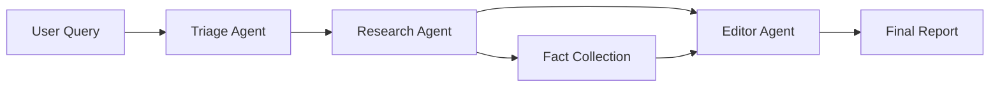

## Overview

The OpenAI Research Agent is a sophisticated multi-agent application built with OpenAI's Agents SDK and Streamlit. It leverages specialized AI agents working together to conduct comprehensive research on any topic and generate detailed, well-structured reports with source citations.

## Features

<CardGroup cols={2}>
  <Card title="Multi-Agent System" icon="network-wired">
    Three specialized agents work in coordination:
    - **Triage Agent**: Plans research strategy
    - **Research Agent**: Searches and collects information
    - **Editor Agent**: Compiles professional reports
  </Card>
  
  <Card title="Intelligent Research" icon="brain">
    - Automated web search and fact collection
    - Source attribution for all information
    - Real-time research progress tracking
    - Structured data extraction
  </Card>
  
  <Card title="Professional Reports" icon="file-lines">
    - Comprehensive 1000+ word reports
    - Structured outlines and sections
    - Markdown formatting
    - Downloadable format
  </Card>
  
  <Card title="Advanced Monitoring" icon="chart-line">
    - Integrated tracing for entire workflow
    - Real-time fact collection display
    - Research process visualization
    - Error handling and fallbacks
  </Card>
</CardGroup>

## Architecture

The system uses a coordinated multi-agent approach:



### Agent Roles

<Tabs>
  <Tab title="Triage Agent">
    **Responsibility**: Research planning and coordination
    
    - Analyzes user's research topic
    - Creates structured research plan with:
      - Clear topic statement
      - 3-5 specific search queries
      - 3-5 key focus areas
    - Coordinates handoffs between agents
    - Ensures workflow completion
    
    **Model**: GPT-4o-mini
  </Tab>
  
  <Tab title="Research Agent">
    **Responsibility**: Information gathering
    
    - Executes web searches using search queries
    - Extracts relevant information from results
    - Saves important facts with source attribution
    - Produces 2-3 paragraph summaries per query
    - Focuses on essence, ignoring fluff
    
    **Tools**:
    - WebSearchTool for internet searches
    - save_important_fact for fact collection
    
    **Model**: GPT-4o-mini
  </Tab>
  
  <Tab title="Editor Agent">
    **Responsibility**: Report compilation
    
    - Reviews all collected research
    - Creates structured report outline
    - Writes comprehensive 1000+ word reports
    - Ensures proper citations and formatting
    - Outputs in markdown format
    
    **Output Structure**:
    - Title
    - Outline sections
    - Full report content
    - Source citations
    - Word count
    
    **Model**: GPT-4o-mini
  </Tab>
</Tabs>

## Setup

<Steps>
  <Step title="Clone the Repository">
    ```bash
    git clone https://github.com/Shubhamsaboo/awesome-llm-apps.git
    cd awesome-llm-apps/starter_ai_agents/openai_research_agent
    ```
  </Step>
  
  <Step title="Install Dependencies">
    ```bash
    pip install -r requirements.txt
    ```
    
    **Required packages:**
    - `openai-agents` - OpenAI Agents SDK
    - `openai` - OpenAI API client
    - `streamlit` - Web interface
    - `uuid` - Unique identifiers
    - `pydantic` - Data validation
    - `python-dotenv` - Environment management
    - `asyncio` - Async operations
  </Step>
  
  <Step title="Configure API Key">
    Set your OpenAI API key as an environment variable:
    
    ```bash
    export OPENAI_API_KEY='your-api-key-here'
    ```
    
    Or create a `.env` file:
    ```bash
    OPENAI_API_KEY=your-api-key-here
    ```
    
    Get your API key from [OpenAI Platform](https://platform.openai.com/)
  </Step>
  
  <Step title="Run the Application">
    ```bash
    streamlit run research_agent.py
    ```
    
    Navigate to `http://localhost:8501` in your browser
  </Step>
</Steps>

## Usage

### Conducting Research

<Steps>
  <Step title="Enter Topic">
    Type your research topic in the sidebar or select from example topics
  </Step>
  
  <Step title="Start Research">
    Click "Start Research" to begin the multi-agent workflow
  </Step>
  
  <Step title="Monitor Progress">
    Watch real-time updates in the "Research Process" tab:
    - Research plan creation
    - Fact collection as it happens
    - Editor report compilation
  </Step>
  
  <Step title="View Report">
    Switch to the "Report" tab to see the final comprehensive report with:
    - Full markdown-formatted content
    - Structured outline
    - Source citations
    - Download option
  </Step>
</Steps>

## Code Example

### Custom Fact Collection Tool

```python
from agents import function_tool
import streamlit as st
from datetime import datetime

@function_tool
def save_important_fact(fact: str, source: str = None) -> str:
    """Save an important fact discovered during research.
    
    Args:
        fact: The important fact to save
        source: Optional source of the fact
    
    Returns:
        Confirmation message
    """
    if "collected_facts" not in st.session_state:
        st.session_state.collected_facts = []
    
    st.session_state.collected_facts.append({
        "fact": fact,
        "source": source or "Not specified",
        "timestamp": datetime.now().strftime("%H:%M:%S")
    })
    
    return f"Fact saved: {fact}"
```

### Agent Configuration

```python
from agents import Agent, Runner, WebSearchTool, handoff, trace
from pydantic import BaseModel

# Define data models
class ResearchPlan(BaseModel):
    topic: str
    search_queries: list[str]
    focus_areas: list[str]

class ResearchReport(BaseModel):
    title: str
    outline: list[str]
    report: str
    sources: list[str]
    word_count: int

# Research Agent
research_agent = Agent(
    name="Research Agent",
    instructions="""
    You are a research assistant. Given a search term, you search 
    the web and produce a concise summary of results. The summary 
    must be 2-3 paragraphs and less than 300 words.
    """,
    model="gpt-4o-mini",
    tools=[WebSearchTool(), save_important_fact],
)

# Editor Agent
editor_agent = Agent(
    name="Editor Agent",
    handoff_description="A senior researcher who writes comprehensive reports",
    instructions="""
    You are a senior researcher tasked with writing a cohesive report. 
    Create an outline first, then generate a lengthy and detailed report 
    in markdown format. Aim for 5-10 pages, at least 1000 words.
    """,
    model="gpt-4o-mini",
    output_type=ResearchReport,
)

# Triage Agent (Coordinator)
triage_agent = Agent(
    name="Triage Agent",
    instructions="""
    You are the coordinator. Your job is to:
    1. Understand the user's research topic
    2. Create a research plan (topic, search_queries, focus_areas)
    3. Hand off to the Research Agent
    4. After research, hand off to the Editor Agent
    """,
    handoffs=[handoff(research_agent), handoff(editor_agent)],
    model="gpt-4o-mini",
    output_type=ResearchPlan,
)
```

### Running the Research Workflow

```python
import asyncio
import uuid

async def run_research(topic):
    # Create a unique conversation ID for tracing
    conversation_id = str(uuid.uuid4().hex[:16])
    
    # Trace the entire workflow
    with trace("News Research", group_id=conversation_id):
        # Start with triage agent
        triage_result = await Runner.run(
            triage_agent,
            f"Research this topic thoroughly: {topic}"
        )
        
        # Get the research plan
        research_plan = triage_result.final_output
        
        # Editor agent compiles the report
        report_result = await Runner.run(
            editor_agent,
            triage_result.to_input_list()
        )
        
        return report_result.final_output

# Run the async function
report = asyncio.run(run_research("AI developments in 2024"))
```

## Example Topics

The app includes pre-configured example topics:

<AccordionGroup>
  <Accordion title="Travel Research" icon="ship">
    "What are the best cruise lines in USA for first-time travelers who have never been on a cruise?"
    
    **Expected Output**: Comparison of cruise lines, pricing, routes, amenities, and first-timer tips
  </Accordion>
  
  <Accordion title="Product Research" icon="coffee">
    "What are the best affordable espresso machines for someone upgrading from a French press?"
    
    **Expected Output**: Machine comparisons, price ranges, features, and upgrade recommendations
  </Accordion>
  
  <Accordion title="Destination Research" icon="map">
    "What are the best off-the-beaten-path destinations in India for a first-time solo traveler?"
    
    **Expected Output**: Hidden gems, safety tips, cultural insights, and travel logistics
  </Accordion>
</AccordionGroup>

## Streamlit Interface Features

### Two-Tab Layout

<Tabs>
  <Tab title="Research Process">
    **Real-time monitoring** of the research workflow:
    
    - Research plan display
    - Live fact collection with sources
    - Agent status updates
    - Progress indicators
    - Report preview snippet
  </Tab>
  
  <Tab title="Report">
    **Final report display** with:
    
    - Expandable outline section
    - Full markdown-rendered content
    - Word count statistics
    - Source citations
    - Download button for .md file
  </Tab>
</Tabs>

### State Management

```python
import streamlit as st

# Initialize session state
if "conversation_id" not in st.session_state:
    st.session_state.conversation_id = str(uuid.uuid4().hex[:16])
if "collected_facts" not in st.session_state:
    st.session_state.collected_facts = []
if "research_done" not in st.session_state:
    st.session_state.research_done = False
if "report_result" not in st.session_state:
    st.session_state.report_result = None
```

## Advanced Features

### Tracing and Monitoring

The app includes integrated tracing for the entire workflow:

```python
from agents import trace

with trace("News Research", group_id=conversation_id):
    # All agent operations are traced
    result = await Runner.run(agent, message)
```

**Benefits:**
- Debug agent interactions
- Monitor performance
- Track token usage
- Identify bottlenecks

### Error Handling

Robust error handling with fallbacks:

```python
try:
    report_result = await Runner.run(editor_agent, triage_result.to_input_list())
    st.session_state.report_result = report_result.final_output
except Exception as e:
    st.error(f"Error generating report: {str(e)}")
    # Fallback to display raw agent response
    if hasattr(triage_result, 'new_items'):
        messages = [item for item in triage_result.new_items]
        raw_content = "\n\n".join([str(m.content) for m in messages])
        st.session_state.report_result = raw_content
```

## Use Cases

<CardGroup cols={2}>
  <Card title="Market Research" icon="chart-line">
    Research competitors, market trends, and industry analysis
  </Card>
  
  <Card title="Academic Research" icon="graduation-cap">
    Gather information for papers, literature reviews, and studies
  </Card>
  
  <Card title="Product Research" icon="shopping-cart">
    Compare products, read reviews, and make informed purchase decisions
  </Card>
  
  <Card title="Travel Planning" icon="plane">
    Research destinations, accommodations, and travel tips
  </Card>
</CardGroup>

## Performance Considerations

<Warning>
  **API Costs**: Each research session uses multiple API calls. The Research Agent makes several web searches, and the Editor Agent generates long-form content. Monitor your OpenAI usage.
</Warning>

<Info>
  **Processing Time**: Complex topics may take 30-60 seconds to research and compile. The app provides real-time progress updates during this time.
</Info>

<Tip>
  **Best Results**: For more comprehensive reports, use specific topics. Instead of "AI", try "Recent developments in AI safety and alignment research".
</Tip>

## Troubleshooting

<AccordionGroup>
  <Accordion title="API Key Not Found">
    Ensure your `OPENAI_API_KEY` environment variable is set:
    ```bash
    echo $OPENAI_API_KEY
    ```
    If empty, set it in your `.env` file or export it in your shell.
  </Accordion>
  
  <Accordion title="Async Errors">
    If you see asyncio-related errors, ensure you're using Python 3.7+. The app uses `asyncio.run()` which requires modern Python.
  </Accordion>
  
  <Accordion title="Empty Reports">
    If reports are empty or incomplete, check:
    - Topic is specific enough
    - Internet connection is stable
    - OpenAI API is operational
    - No rate limit issues
  </Accordion>
</AccordionGroup>

## Next Steps

<CardGroup cols={2}>
  <Card title="Customize Agents" icon="wrench">
    Modify agent instructions to specialize in specific research domains
  </Card>
  
  <Card title="Add More Tools" icon="toolbox">
    Integrate additional tools like academic databases or specialized APIs
  </Card>
  
  <Card title="Explore Examples" icon="compass" href="/examples/ai-data-analysis">
    Check out more AI agent examples
  </Card>
  
  <Card title="GitHub Repository" icon="github" href="https://github.com/Shubhamsaboo/awesome-llm-apps">
    View the complete source code
  </Card>
</CardGroup>