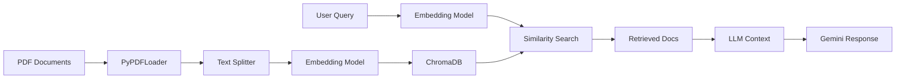

# Basic RAG Chain

A basic RAG (Retrieval-Augmented Generation) chain demonstrates the fundamental pattern of retrieving relevant documents and using them to generate contextually accurate responses.

## Overview

This example shows how to build a complete RAG system called **PharmaQuery** - a pharmaceutical insight retrieval system that helps users gain meaningful insights from research papers.

<CardGroup cols={2}>
  <Card title="Document Loading" icon="file-arrow-up">
    Load and process PDF documents with PyPDFLoader
  </Card>
  <Card title="Text Splitting" icon="scissors">
    Split documents into chunks using SentenceTransformers
  </Card>
  <Card title="Vector Storage" icon="database">
    Store embeddings in ChromaDB for fast retrieval
  </Card>
  <Card title="Query Processing" icon="magnifying-glass">
    Retrieve relevant chunks and generate answers with Gemini
  </Card>
</CardGroup>

## Architecture



## Implementation

### Installation

<Steps>
  <Step title="Install dependencies">
    ```bash
    pip install streamlit langchain-google-genai langchain-chroma \
                langchain-community chromadb sentence-transformers \
                PyPDF2 python-dotenv
    ```
  </Step>
  
  <Step title="Set up API keys">
    ```bash
    export GOOGLE_API_KEY='your-gemini-api-key'
    ```
    
    Get your API key from [Google AI Studio](https://aistudio.google.com/app/apikey)
  </Step>
</Steps>

### Complete Code

<Tabs>
  <Tab title="app.py">
    ```python
    import streamlit as st
    from langchain_community.document_loaders import PyPDFLoader
    from langchain_text_splitters import SentenceTransformersTokenTextSplitter
    from langchain_google_genai import GoogleGenerativeAIEmbeddings, ChatGoogleGenerativeAI
    from langchain_chroma import Chroma
    from langchain.chains import RetrievalQA
    import tempfile
    import os

    st.title("PharmaQuery - Pharmaceutical Insight Retrieval")
    
    # Sidebar for API key and document upload
    with st.sidebar:
        google_api_key = st.text_input("Google API Key", type="password")
        uploaded_files = st.file_uploader(
            "Upload Research Papers (PDF)", 
            type="pdf",
            accept_multiple_files=True
        )
    
    if google_api_key:
        # Initialize embedding model
        embeddings = GoogleGenerativeAIEmbeddings(
            model="models/embedding-001",
            google_api_key=google_api_key
        )
        
        # Initialize vector store
        vectorstore = Chroma(
            embedding_function=embeddings,
            persist_directory="./chroma_db"
        )
        
        # Process uploaded documents
        if uploaded_files:
            for uploaded_file in uploaded_files:
                with tempfile.NamedTemporaryFile(delete=False, suffix=".pdf") as tmp_file:
                    tmp_file.write(uploaded_file.read())
                    tmp_path = tmp_file.name
                
                # Load and split document
                loader = PyPDFLoader(tmp_path)
                documents = loader.load()
                
                # Split into chunks
                text_splitter = SentenceTransformersTokenTextSplitter(
                    chunk_size=512,
                    chunk_overlap=50
                )
                chunks = text_splitter.split_documents(documents)
                
                # Add to vector store
                vectorstore.add_documents(chunks)
                
                os.unlink(tmp_path)
                st.sidebar.success(f"Processed {uploaded_file.name}")
        
        # Query interface
        query = st.text_input("Enter your query:")
        
        if query:
            # Initialize LLM
            llm = ChatGoogleGenerativeAI(
                model="gemini-1.5-pro",
                google_api_key=google_api_key,
                temperature=0.3
            )
            
            # Create retrieval chain
            qa_chain = RetrievalQA.from_chain_type(
                llm=llm,
                chain_type="stuff",
                retriever=vectorstore.as_retriever(search_kwargs={"k": 4})
            )
            
            # Get response
            with st.spinner("Searching and generating response..."):
                response = qa_chain.invoke({"query": query})
                st.write("### Answer")
                st.write(response["result"])
                
                # Show retrieved documents
                with st.expander("View Source Documents"):
                    docs = vectorstore.similarity_search(query, k=4)
                    for i, doc in enumerate(docs, 1):
                        st.write(f"**Document {i}:**")
                        st.write(doc.page_content[:500] + "...")
    else:
        st.warning("Please enter your Google API Key in the sidebar")
    ```
  </Tab>
  
  <Tab title="requirements.txt">
    ```text
    streamlit
    langchain-google-genai
    langchain-chroma
    langchain-community
    langchain-core
    chromadb
    sentence-transformers
    PyPDF2
    python-dotenv
    ```
  </Tab>
</Tabs>

## Key Components

### Document Loading

```python
from langchain_community.document_loaders import PyPDFLoader

loader = PyPDFLoader("research_paper.pdf")
documents = loader.load()
```

<Note>
  PyPDFLoader extracts text while preserving document structure and metadata.
</Note>

### Text Splitting

```python
from langchain_text_splitters import SentenceTransformersTokenTextSplitter

text_splitter = SentenceTransformersTokenTextSplitter(
    chunk_size=512,      # Tokens per chunk
    chunk_overlap=50     # Overlap between chunks
)
chunks = text_splitter.split_documents(documents)
```

<Tip>
  Use token-based splitting with SentenceTransformers for better semantic coherence compared to character-based splitting.
</Tip>

### Vector Storage

```python
from langchain_chroma import Chroma
from langchain_google_genai import GoogleGenerativeAIEmbeddings

embeddings = GoogleGenerativeAIEmbeddings(model="models/embedding-001")
vectorstore = Chroma(
    embedding_function=embeddings,
    persist_directory="./chroma_db"
)

# Add documents
vectorstore.add_documents(chunks)
```

### Retrieval & Generation

```python
from langchain.chains import RetrievalQA

qa_chain = RetrievalQA.from_chain_type(
    llm=llm,
    chain_type="stuff",          # Stuff all docs into context
    retriever=vectorstore.as_retriever(search_kwargs={"k": 4})
)

response = qa_chain.invoke({"query": "What are the side effects?"})
```

## Usage

<Steps>
  <Step title="Run the application">
    ```bash
    streamlit run app.py
    ```
  </Step>
  
  <Step title="Enter API key">
    Paste your Google API Key in the sidebar
  </Step>
  
  <Step title="Upload documents">
    Upload research papers (PDFs) to build your knowledge base
  </Step>
  
  <Step title="Query the system">
    Ask questions about the uploaded documents
  </Step>
</Steps>

## Example Queries

<Accordion title="Pharmaceutical Research">
  - "What are the clinical trial results for this drug?"
  - "Summarize the methodology used in this study"
  - "What safety concerns were identified?"
  - "Compare efficacy across different patient groups"
</Accordion>

<Accordion title="Technical Questions">
  - "What statistical methods were used?"
  - "What were the inclusion/exclusion criteria?"
  - "How was the sample size determined?"
  - "What were the limitations of this study?"
</Accordion>

## Customization Options

### Embedding Models

<Tabs>
  <Tab title="Google Gemini">
    ```python
    from langchain_google_genai import GoogleGenerativeAIEmbeddings
    
    embeddings = GoogleGenerativeAIEmbeddings(
        model="models/embedding-001"
    )
    ```
  </Tab>
  
  <Tab title="OpenAI">
    ```python
    from langchain_openai import OpenAIEmbeddings
    
    embeddings = OpenAIEmbeddings(
        model="text-embedding-3-small"
    )
    ```
  </Tab>
  
  <Tab title="HuggingFace (Local)">
    ```python
    from langchain_community.embeddings import HuggingFaceEmbeddings
    
    embeddings = HuggingFaceEmbeddings(
        model_name="sentence-transformers/all-MiniLM-L6-v2"
    )
    ```
  </Tab>
</Tabs>

### Vector Databases

<Tabs>
  <Tab title="ChromaDB">
    ```python
    from langchain_chroma import Chroma
    
    vectorstore = Chroma(
        embedding_function=embeddings,
        persist_directory="./chroma_db"
    )
    ```
  </Tab>
  
  <Tab title="Qdrant">
    ```python
    from langchain_qdrant import Qdrant
    from qdrant_client import QdrantClient
    
    client = QdrantClient(path="./qdrant_db")
    vectorstore = Qdrant(
        client=client,
        collection_name="documents",
        embeddings=embeddings
    )
    ```
  </Tab>
  
  <Tab title="FAISS">
    ```python
    from langchain_community.vectorstores import FAISS
    
    vectorstore = FAISS.from_documents(chunks, embeddings)
    vectorstore.save_local("./faiss_index")
    ```
  </Tab>
</Tabs>

## Best Practices

<AccordionGroup>
  <Accordion title="Chunk Size Selection">
    - **Small chunks (256-512 tokens)**: Better precision, more retrievals needed
    - **Medium chunks (512-1024 tokens)**: Balanced approach (recommended)
    - **Large chunks (1024-2048 tokens)**: More context, but less precise
    
    Adjust based on your document type and query patterns.
  </Accordion>
  
  <Accordion title="Overlap Strategy">
    - Use 10-20% overlap to maintain context across chunks
    - Too much overlap increases storage and redundancy
    - Too little overlap may lose important context at boundaries
  </Accordion>
  
  <Accordion title="Retrieval Parameters">
    ```python
    retriever = vectorstore.as_retriever(
        search_type="similarity",    # or "mmr" for diversity
        search_kwargs={
            "k": 4,                   # Number of documents to retrieve
            "score_threshold": 0.7    # Minimum similarity score
        }
    )
    ```
  </Accordion>
</AccordionGroup>

## Troubleshooting

<AccordionGroup>
  <Accordion title="Empty or irrelevant responses">
    **Solutions:**
    - Increase `k` value to retrieve more documents
    - Lower `score_threshold` to allow less similar matches
    - Improve document chunking strategy
    - Use query expansion or reformulation
  </Accordion>
  
  <Accordion title="Slow performance">
    **Solutions:**
    - Reduce chunk size to decrease embedding time
    - Use a faster embedding model
    - Enable vector store caching
    - Consider using a more efficient vector database
  </Accordion>
  
  <Accordion title="High memory usage">
    **Solutions:**
    - Process documents in batches
    - Use a disk-based vector store (ChromaDB, Qdrant)
    - Reduce embedding dimensions if possible
    - Clean up temporary files after processing
  </Accordion>
</AccordionGroup>

## Related Examples

<CardGroup cols={2}>
  <Card title="Agentic RAG" icon="robot" href="/rag/agentic-rag">
    Add reasoning and self-correction to your RAG system
  </Card>
  <Card title="Corrective RAG" icon="shield-check" href="/examples/corrective-rag">
    Implement self-evaluating retrieval with fallback strategies
  </Card>
  <Card title="Hybrid Search" icon="arrows-split-up-and-left" href="/rag/advanced-techniques">
    Combine vector search with keyword search for better results
  </Card>
  <Card title="Local RAG" icon="house" href="/rag/local-rag">
    Build a privacy-focused RAG system with local models
  </Card>
</CardGroup>
