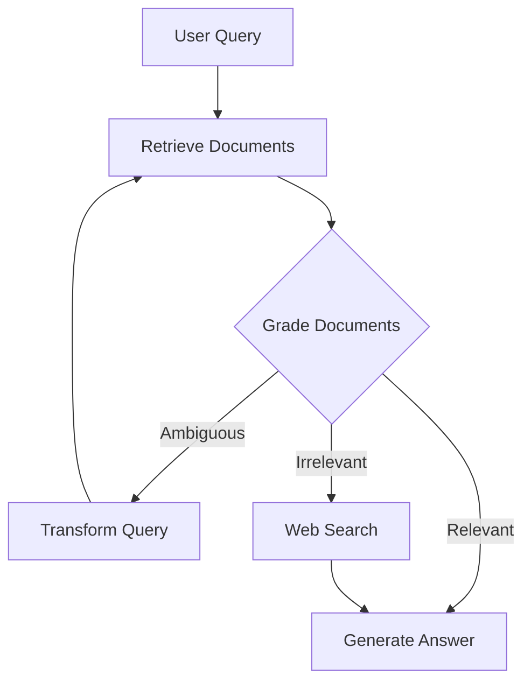

# Corrective RAG (CRAG)

Corrective RAG adds self-evaluation and correction mechanisms to traditional RAG, using LangGraph to implement a sophisticated workflow that validates retrievals and uses fallback strategies when needed.

## Overview

CRAG evaluates the quality of retrieved documents and takes corrective actions:
- **Relevant documents**: Use directly for generation
- **Ambiguous documents**: Apply query transformation and re-retrieve
- **Irrelevant documents**: Fall back to web search

<Note>
  CRAG significantly improves answer accuracy by validating retrieval quality before generation.
</Note>

## Architecture

## Implementation

See the [Advanced RAG Techniques](/rag/advanced-techniques) page for complete CRAG implementation with LangGraph.

<CardGroup cols={2}>
  <Card title="Document Grading" icon="check-circle">
    Evaluate retrieval relevance with LLM-based grading
  </Card>
  <Card title="Query Transformation" icon="repeat">
    Rewrite queries for better retrieval on ambiguous results
  </Card>
  <Card title="Web Search Fallback" icon="globe">
    Use Tavily AI for web search when local docs insufficient
  </Card>
  <Card title="LangGraph Workflow" icon="diagram-project">
    Orchestrate the complete CRAG workflow with state management
  </Card>
</CardGroup>

## Related Examples

<Card title="Advanced RAG Techniques" icon="wand-magic-sparkles" href="/rag/advanced-techniques">
  Complete CRAG implementation with code examples and LangGraph workflow
</Card>