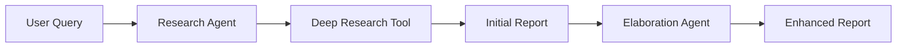

## Overview

The AI Deep Research Agent is a powerful research assistant that leverages OpenAI's Agents SDK and Firecrawl's deep research capabilities to perform comprehensive web research on any topic. The system uses a two-agent architecture where one agent performs deep research and another enhances the findings with additional context and insights.

<Card title="Tutorial Available" icon="graduation-cap" href="https://www.theunwindai.com/p/build-a-deep-research-agent-with-openai-agents-sdk-and-firecrawl">
  Follow our complete step-by-step tutorial to build this from scratch
</Card>

## Architecture

### Agent Coordination Pattern

The Deep Research Agent uses a **sequential coordination pattern** with two specialized agents:



### Agent Roles

<AccordionGroup>
  <Accordion title="Research Agent" icon="search">
    **Responsibilities:**
    - Perform deep web research using Firecrawl
    - Gather comprehensive information from multiple sources
    - Organize findings into structured reports
    - Include proper citations
    
    **Tools:**
    - `deep_research`: Firecrawl's deep research endpoint with configurable depth and time limits
    
    **Configuration:**
    ```python
    max_depth: 3        # Search depth
    time_limit: 180     # 3 minutes
    max_urls: 10        # Number of sources
    ```
  </Accordion>

  <Accordion title="Elaboration Agent" icon="pen-to-square">
    **Responsibilities:**
    - Enhance initial research reports
    - Add detailed explanations of complex concepts
    - Include relevant examples and case studies
    - Expand on key points with additional context
    - Add visual element descriptions
    - Incorporate trends and predictions
    
    **Approach:**
    - Maintains academic rigor
    - Preserves original structure
    - Focuses on value-added content
  </Accordion>
</AccordionGroup>

## Implementation

<Tabs>
  <Tab title="Complete Agent System">
    ```python
    import asyncio
    import streamlit as st
    from agents import Agent, Runner
    from agents import set_default_openai_key
    from firecrawl import FirecrawlApp
    from agents.tool import function_tool

    # Deep Research Tool
    @function_tool
    async def deep_research(query: str, max_depth: int, 
                           time_limit: int, max_urls: int):
        """
        Perform comprehensive web research using Firecrawl's 
        deep research endpoint.
        """
        firecrawl_app = FirecrawlApp(api_key=firecrawl_api_key)
        
        params = {
            "maxDepth": max_depth,
            "timeLimit": time_limit,
            "maxUrls": max_urls
        }
        
        results = firecrawl_app.deep_research(
            query=query,
            params=params,
            on_activity=lambda a: st.write(f"[{a['type']}] {a['message']}")
        )
        
        return {
            "success": True,
            "final_analysis": results['data']['finalAnalysis'],
            "sources_count": len(results['data']['sources']),
            "sources": results['data']['sources']
        }

    # Research Agent
    research_agent = Agent(
        name="research_agent",
        instructions="""You are a research assistant that can perform 
        deep web research on any topic.
        
        When given a research topic:
        1. Use the deep_research tool with max_depth=3, time_limit=180, max_urls=10
        2. Review the research results and organize them into a report
        3. Include proper citations for all sources
        4. Highlight key findings and insights
        """,
        tools=[deep_research]
    )

    # Elaboration Agent
    elaboration_agent = Agent(
        name="elaboration_agent",
        instructions="""You are an expert content enhancer specializing 
        in research elaboration.
        
        When given a research report:
        1. Analyze the structure and content
        2. Add detailed explanations of complex concepts
        3. Include relevant examples and case studies
        4. Expand on key points with additional context
        5. Add visual element descriptions
        6. Incorporate latest trends and predictions
        7. Suggest practical implications
        """
    )

    # Research Process
    async def run_research_process(topic: str):
        # Step 1: Initial Research
        research_result = await Runner.run(research_agent, topic)
        initial_report = research_result.final_output
        
        # Step 2: Enhance the report
        elaboration_input = f"""
        RESEARCH TOPIC: {topic}
        
        INITIAL RESEARCH REPORT:
        {initial_report}
        
        Please enhance this research report with additional information, 
        examples, case studies, and deeper insights.
        """
        
        elaboration_result = await Runner.run(
            elaboration_agent, 
            elaboration_input
        )
        
        return elaboration_result.final_output
    ```
  </Tab>

  <Tab title="Streamlit Interface">
    ```python
    import streamlit as st

    st.title("📘 OpenAI Deep Research Agent")
    st.markdown("""This agent performs deep research on any topic 
                using Firecrawl""")

    # API Configuration
    with st.sidebar:
        st.title("API Configuration")
        openai_api_key = st.text_input(
            "OpenAI API Key", 
            type="password"
        )
        firecrawl_api_key = st.text_input(
            "Firecrawl API Key", 
            type="password"
        )
        
        if openai_api_key:
            set_default_openai_key(openai_api_key)

    # Research Input
    research_topic = st.text_input(
        "Enter your research topic:", 
        placeholder="e.g., Latest developments in AI"
    )

    # Start Research
    if st.button("Start Research"):
        if not (openai_api_key and firecrawl_api_key and research_topic):
            st.warning("Please enter all required fields.")
        else:
            # Run research process
            enhanced_report = asyncio.run(
                run_research_process(research_topic)
            )
            
            # Display report
            st.markdown("## Enhanced Research Report")
            st.markdown(enhanced_report)
            
            # Download button
            st.download_button(
                "Download Report",
                enhanced_report,
                file_name=f"{research_topic.replace(' ', '_')}_report.md",
                mime="text/markdown"
            )
    ```
  </Tab>

  <Tab title="Tool Configuration">
    ```python
    from agents.tool import function_tool
    from firecrawl import FirecrawlApp

    @function_tool
    async def deep_research(
        query: str, 
        max_depth: int = 3,
        time_limit: int = 180,
        max_urls: int = 10
    ) -> dict:
        """
        Perform comprehensive web research using Firecrawl.
        
        Args:
            query: Research topic or question
            max_depth: Search depth (1-5)
            time_limit: Time limit in seconds
            max_urls: Maximum number of URLs to analyze
            
        Returns:
            dict: Research results with analysis and sources
        """
        try:
            firecrawl_app = FirecrawlApp(api_key=api_key)
            
            params = {
                "maxDepth": max_depth,
                "timeLimit": time_limit,
                "maxUrls": max_urls
            }
            
            # Set up activity callback
            def on_activity(activity):
                print(f"[{activity['type']}] {activity['message']}")
            
            # Run deep research
            results = firecrawl_app.deep_research(
                query=query,
                params=params,
                on_activity=on_activity
            )
            
            return {
                "success": True,
                "final_analysis": results['data']['finalAnalysis'],
                "sources_count": len(results['data']['sources']),
                "sources": results['data']['sources']
            }
        except Exception as e:
            return {
                "error": str(e), 
                "success": False
            }
    ```
  </Tab>
</Tabs>

## Key Features

<CardGroup cols={2}>
  <Card title="Deep Web Research" icon="globe">
    Automatically searches the web, extracts content, and synthesizes findings from multiple sources
  </Card>
  <Card title="Enhanced Analysis" icon="chart-line">
    Uses AI to elaborate on research findings with additional context and insights
  </Card>
  <Card title="Interactive UI" icon="window">
    Clean Streamlit interface for easy interaction and real-time progress updates
  </Card>
  <Card title="Downloadable Reports" icon="download">
    Export research findings as markdown files for offline use
  </Card>
</CardGroup>

## Research Process

1. **Input Phase**: User provides a research topic and API credentials
2. **Research Phase**: The tool uses Firecrawl to search the web and extract relevant information
3. **Analysis Phase**: An initial research report is generated based on the findings
4. **Enhancement Phase**: A second agent elaborates on the initial report, adding depth and context
5. **Output Phase**: The enhanced report is presented to the user and available for download

## Example Research Topics

<CodeGroup>
```text Technology
Latest developments in quantum computing
```

```text Science
Impact of climate change on marine ecosystems
```

```text Energy
Advancements in renewable energy storage
```

```text Ethics
Ethical considerations in artificial intelligence
```

```text Business
Emerging trends in remote work technologies
```
</CodeGroup>

## Installation

<Steps>
  <Step title="Clone Repository">
    ```bash
    git clone https://github.com/Shubhamsaboo/awesome-llm-apps.git
    cd advanced_ai_agents/single_agent_apps/ai_deep_research_agent
    ```
  </Step>
  
  <Step title="Install Dependencies">
    ```bash
    pip install -r requirements.txt
    ```
    
    Required packages:
    - `openai-agents`
    - `firecrawl-py`
    - `streamlit`
  </Step>
  
  <Step title="Run Application">
    ```bash
    streamlit run deep_research_openai.py
    ```
  </Step>
  
  <Step title="Configure API Keys">
    Enter your API keys in the sidebar:
    - OpenAI API key from [platform.openai.com](https://platform.openai.com)
    - Firecrawl API key from [firecrawl.dev](https://firecrawl.dev)
  </Step>
</Steps>

## Technical Details

### Agent Communication

The agents communicate through a sequential handoff pattern:

```python
# Research Agent produces initial output
research_result = await Runner.run(research_agent, topic)
initial_report = research_result.final_output

# Elaboration Agent receives initial output as context
elaboration_input = f"""
RESEARCH TOPIC: {topic}
INITIAL RESEARCH REPORT: {initial_report}
...
"""

elaboration_result = await Runner.run(elaboration_agent, elaboration_input)
```

### Firecrawl Integration

Firecrawl's deep research tool performs:
- Multiple iterations of web searches
- Content extraction from various sources
- Automatic synthesis of findings
- Citation management

### Performance Considerations

<Warning>
  Deep research can take several minutes depending on:
  - `max_depth`: Higher depth = more thorough but slower
  - `time_limit`: Maximum time allowed for research
  - `max_urls`: Number of sources to analyze
  
  Typical research takes 3-5 minutes with default settings.
</Warning>

## Best Practices

<AccordionGroup>
  <Accordion title="Query Formulation">
    - Be specific in your research queries
    - Include context for better results
    - Use clear, focused questions
    - Avoid overly broad topics
  </Accordion>
  
  <Accordion title="Parameter Tuning">
    - Start with default parameters (depth=3, time=180s, urls=10)
    - Increase depth for more comprehensive research
    - Adjust time_limit based on topic complexity
    - More URLs provide broader coverage but take longer
  </Accordion>
  
  <Accordion title="Cost Management">
    - Each research query uses both OpenAI and Firecrawl API calls
    - Monitor your API usage in both dashboards
    - Consider caching results for similar queries
    - Use appropriate model tiers for your needs
  </Accordion>
</AccordionGroup>

## Related Examples

<CardGroup cols={3}>
  <Card title="Multi-Agent Researcher" icon="users" href="/examples/multi-agent-researcher">
    Advanced multi-agent research system
  </Card>
  <Card title="Legal Agent Team" icon="scale-balanced" href="/examples/legal-agent-team">
    Document analysis with agent teams
  </Card>
  <Card title="Finance Agent Team" icon="chart-line" href="/examples/finance-agent-team">
    Financial research and analysis
  </Card>
</CardGroup>