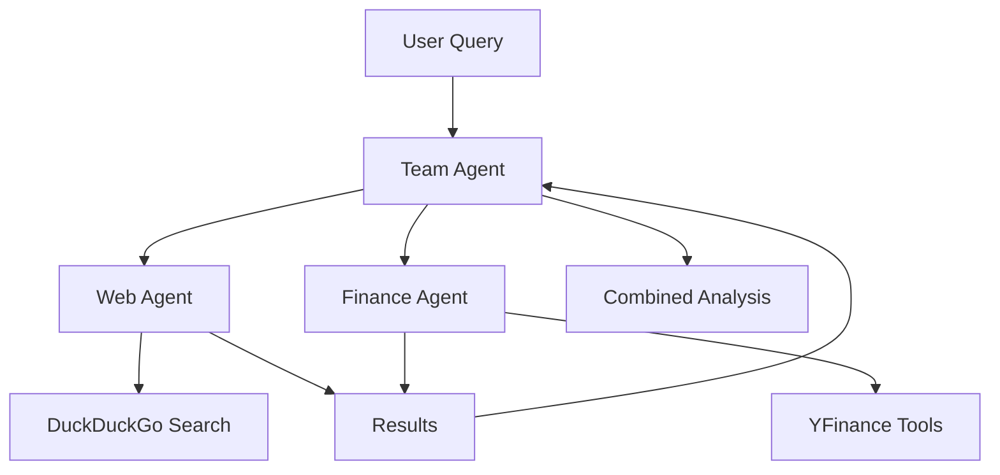

## Overview

The AI Finance Agent Team demonstrates how to build a collaborative team of AI agents that work together as financial analysts. This system combines web search capabilities with real-time financial data analysis tools to provide comprehensive financial insights in just 20 lines of Python code.

## Architecture

### Multi-Agent Team Structure

The Finance Agent Team uses a **team coordination pattern** where specialized agents collaborate under a team lead:



### Agent Roles

<CardGroup cols={3}>
  <Card title="Web Agent" icon="globe">
    **Role:** Search the web for information
    
    **Tools:**
    - DuckDuckGo search
    
    **Capabilities:**
    - General internet research
    - News and articles
    - Market sentiment
  </Card>
  
  <Card title="Finance Agent" icon="dollar-sign">
    **Role:** Get financial data
    
    **Tools:**
    - Current stock prices
    - Analyst recommendations
    - Company information
    - Company news
    
    **Display:** Always uses tables for data
  </Card>
  
  <Card title="Team Agent" icon="users">
    **Role:** Coordinate between agents
    
    **Responsibilities:**
    - Route queries to appropriate agents
    - Combine insights from both agents
    - Present unified analysis
  </Card>
</CardGroup>

## Implementation

<Tabs>
  <Tab title="Complete System (20 Lines)">
    ```python
    from agno.agent import Agent
    from agno.team import Team
    from agno.models.openai import OpenAIChat
    from agno.db.sqlite import SqliteDb
    from agno.tools.duckduckgo import DuckDuckGoTools
    from agno.tools.yfinance import YFinanceTools
    from agno.os import AgentOS

    # Setup database for storage
    db = SqliteDb(db_file="agents.db")

    # Web Agent
    web_agent = Agent(
        name="Web Agent",
        role="Search the web for information",
        model=OpenAIChat(id="gpt-4o"),
        tools=[DuckDuckGoTools()],
        db=db,
        add_history_to_context=True,
        markdown=True,
    )

    # Finance Agent
    finance_agent = Agent(
        name="Finance Agent",
        role="Get financial data",
        model=OpenAIChat(id="gpt-4o"),
        tools=[YFinanceTools(include_tools=[
            "get_current_stock_price", 
            "get_analyst_recommendations", 
            "get_company_info", 
            "get_company_news"
        ])],
        instructions=["Always use tables to display data"],
        db=db,
        add_history_to_context=True,
        markdown=True,
    )

    # Team Agent
    agent_team = Team(
        name="Agent Team (Web+Finance)",
        model=OpenAIChat(id="gpt-4o"),
        members=[web_agent, finance_agent],
        debug_mode=True,
        markdown=True,
    )

    # AgentOS
    agent_os = AgentOS(teams=[agent_team])
    app = agent_os.get_app()

    if __name__ == "__main__":
        agent_os.serve(app="finance_agent_team:app", reload=True)
    ```
  </Tab>

  <Tab title="Individual Agents">
    ```python
    from agno.agent import Agent
    from agno.models.openai import OpenAIChat
    from agno.tools.duckduckgo import DuckDuckGoTools
    from agno.tools.yfinance import YFinanceTools
    from agno.db.sqlite import SqliteDb

    # Initialize database
    db = SqliteDb(db_file="agents.db")

    # Web Agent - General research
    web_agent = Agent(
        name="Web Agent",
        role="Search the web for information",
        model=OpenAIChat(id="gpt-4o"),
        tools=[DuckDuckGoTools()],
        db=db,
        add_history_to_context=True,
        markdown=True,
    )

    # Finance Agent - Market data
    finance_agent = Agent(
        name="Finance Agent",
        role="Get financial data",
        model=OpenAIChat(id="gpt-4o"),
        tools=[YFinanceTools(include_tools=[
            "get_current_stock_price",
            "get_analyst_recommendations",
            "get_company_info",
            "get_company_news"
        ])],
        instructions=["Always use tables to display data"],
        db=db,
        add_history_to_context=True,
        markdown=True,
    )
    ```
  </Tab>

  <Tab title="Team Configuration">
    ```python
    from agno.team import Team
    from agno.models.openai import OpenAIChat
    from agno.os import AgentOS

    # Create Team with both agents
    agent_team = Team(
        name="Agent Team (Web+Finance)",
        model=OpenAIChat(id="gpt-4o"),
        members=[web_agent, finance_agent],
        debug_mode=True,
        markdown=True,
    )

    # Create AgentOS for serving
    agent_os = AgentOS(teams=[agent_team])
    app = agent_os.get_app()

    # Serve the application
    if __name__ == "__main__":
        agent_os.serve(
            app="finance_agent_team:app", 
            reload=True
        )
    ```
  </Tab>
</Tabs>

## Key Features

<AccordionGroup>
  <Accordion title="Real-Time Financial Data" icon="chart-line">
    **YFinance Integration:**
    - Current stock prices
    - Analyst recommendations
    - Company information and fundamentals
    - Latest company news
    - Historical data analysis
    
    **Data Presentation:**
    - Always formatted in tables
    - Clear, readable format
    - Supports multiple tickers
  </Accordion>

  <Accordion title="Web Search Capabilities" icon="magnifying-glass">
    **DuckDuckGo Search:**
    - General market research
    - News and sentiment analysis
    - Industry trends
    - Competitive intelligence
    - Economic indicators
    
    **Privacy-Focused:**
    - No tracking
    - Anonymous searches
    - Reliable results
  </Accordion>

  <Accordion title="Persistent Storage" icon="database">
    **SQLite Database:**
    - Stores agent interactions
    - Maintains conversation history
    - Context awareness across queries
    - Historical analysis
    
    **Benefits:**
    - Faster follow-up queries
    - Consistent analysis
    - Learning from past interactions
  </Accordion>

  <Accordion title="Team Coordination" icon="users">
    **Intelligent Routing:**
    - Automatically selects appropriate agent
    - Combines insights from multiple agents
    - Unified response format
    
    **Collaboration:**
    - Agents share context
    - Complementary analysis
    - Comprehensive insights
  </Accordion>
</AccordionGroup>

## Agent Coordination Patterns

### Query Routing

The Team Agent intelligently routes queries based on the type of information needed:

<CodeGroup>
```python Market Data Query
# Routed to Finance Agent
"What is the current stock price of AAPL?"
"Show me analyst recommendations for Tesla"
"Get company information for Microsoft"
```

```python Research Query
# Routed to Web Agent
"What are the latest trends in AI technology?"
"Find recent news about renewable energy"
"Search for information on market volatility"
```

```python Combined Query
# Uses both agents
"Analyze Tesla's stock performance and recent news"
"Compare Apple and Microsoft with market context"
"Research semiconductor industry and check NVDA stock"
```
</CodeGroup>

### Agent Handoff

```python
# Example flow for combined query
User: "Analyze TSLA stock and recent news"

1. Team Agent receives query
2. Routes to Finance Agent first
   - Gets stock price
   - Gets analyst recommendations
   - Gets company financials
3. Routes to Web Agent
   - Searches for recent news
   - Finds market sentiment
4. Team Agent combines insights
5. Returns comprehensive analysis
```

## YFinance Tools

### Available Functions

<Tabs>
  <Tab title="get_current_stock_price">
    ```python
    # Get current stock price
    def get_current_stock_price(ticker: str) -> dict:
        """
        Get the current stock price for a ticker symbol.
        
        Args:
            ticker: Stock ticker symbol (e.g., 'AAPL', 'TSLA')
            
        Returns:
            dict: Current price, day high/low, volume, etc.
        """
    ```
    
    **Example:**
    ```
    Query: "What is AAPL stock price?"
    Response: 
    | Metric | Value |
    |--------|-------|
    | Price  | $178.32 |
    | High   | $179.50 |
    | Low    | $177.20 |
    | Volume | 45.2M |
    ```
  </Tab>

  <Tab title="get_analyst_recommendations">
    ```python
    # Get analyst recommendations
    def get_analyst_recommendations(ticker: str) -> dict:
        """
        Get analyst recommendations and ratings.
        
        Args:
            ticker: Stock ticker symbol
            
        Returns:
            dict: Buy/Sell/Hold recommendations, price targets
        """
    ```
    
    **Example:**
    ```
    Query: "Show analyst recommendations for TSLA"
    Response:
    | Rating | Count |
    |--------|-------|
    | Strong Buy | 12 |
    | Buy | 8 |
    | Hold | 5 |
    | Sell | 2 |
    | Target Price | $245 |
    ```
  </Tab>

  <Tab title="get_company_info">
    ```python
    # Get company information
    def get_company_info(ticker: str) -> dict:
        """
        Get detailed company information.
        
        Args:
            ticker: Stock ticker symbol
            
        Returns:
            dict: Company details, sector, market cap, etc.
        """
    ```
    
    **Example:**
    ```
    Query: "Get information about Microsoft"
    Response:
    | Field | Value |
    |-------|-------|
    | Name | Microsoft Corporation |
    | Sector | Technology |
    | Industry | Software |
    | Market Cap | $2.8T |
    | Employees | 221,000 |
    ```
  </Tab>

  <Tab title="get_company_news">
    ```python
    # Get company news
    def get_company_news(ticker: str) -> list:
        """
        Get recent news articles about the company.
        
        Args:
            ticker: Stock ticker symbol
            
        Returns:
            list: Recent news articles with links
        """
    ```
    
    **Example:**
    ```
    Query: "What's the latest news on NVDA?"
    Response:
    - NVIDIA Announces New AI Chip (2 hours ago)
    - Q3 Earnings Beat Expectations (1 day ago)
    - Partnership with Major Cloud Provider (2 days ago)
    ```
  </Tab>
</Tabs>

## Installation

<Steps>
  <Step title="Clone Repository">
    ```bash
    git clone https://github.com/Shubhamsaboo/awesome-llm-apps.git
    cd advanced_ai_agents/multi_agent_apps/agent_teams/ai_finance_agent_team
    ```
  </Step>
  
  <Step title="Install Dependencies">
    ```bash
    pip install -r requirements.txt
    ```
    
    Required packages:
    - `agno>=2.2.10`
    - `openai`
    - `yfinance`
    - `duckduckgo-search`
    - `sqlalchemy`
  </Step>
  
  <Step title="Set OpenAI API Key">
    ```bash
    export OPENAI_API_KEY='your-api-key-here'
    ```
    
    Get your API key from [platform.openai.com](https://platform.openai.com)
  </Step>
  
  <Step title="Run Application">
    ```bash
    python3 finance_agent_team.py
    ```
    
    Open your browser to the URL shown in the console to access the playground interface.
  </Step>
</Steps>

## Usage Examples

<AccordionGroup>
  <Accordion title="Stock Analysis">
    ```
    User: "Analyze Apple stock (AAPL)"
    
    Finance Agent:
    - Current Price: $178.32
    - 52-Week Range: $124.17 - $198.23
    - Market Cap: $2.8T
    - P/E Ratio: 29.5
    - Dividend Yield: 0.52%
    
    Web Agent:
    - Recent product launches
    - Market sentiment: Positive
    - Industry position: Market leader
    
    Team Analysis:
    AAPL shows strong fundamentals with consistent growth.
    Recent iPhone launch driving positive sentiment.
    Analyst consensus: Buy with $195 target price.
    ```
  </Accordion>

  <Accordion title="Industry Research">
    ```
    User: "Research the semiconductor industry and check NVDA"
    
    Web Agent:
    - Industry growing at 8.6% CAGR
    - AI chip demand driving growth
    - Supply chain improving
    - Major players: NVIDIA, AMD, Intel
    
    Finance Agent:
    NVIDIA (NVDA):
    - Price: $495.50
    - Market Cap: $1.2T
    - Forward P/E: 35.2
    - Revenue Growth: 126% YoY
    
    Team Analysis:
    Semiconductor sector shows strong growth driven by AI.
    NVDA is industry leader with commanding market share.
    Stock trading at premium but justified by growth.
    ```
  </Accordion>

  <Accordion title="Comparative Analysis">
    ```
    User: "Compare Tesla and traditional automakers"
    
    Finance Agent:
    | Company | Price | P/E | Market Cap |
    |---------|-------|-----|------------|
    | TSLA | $242.50 | 75.3 | $770B |
    | F | $12.40 | 6.2 | $50B |
    | GM | $32.10 | 5.8 | $42B |
    
    Web Agent:
    - EV market growing rapidly
    - Tesla leads in innovation
    - Traditional automakers catching up
    - Battery technology key differentiator
    
    Team Analysis:
    Tesla commands premium valuation due to tech leadership.
    Traditional automakers cheaper but slower EV transition.
    Market favors growth and innovation in auto sector.
    ```
  </Accordion>
</AccordionGroup>

## Technical Architecture

### Database Storage

```python
from agno.db.sqlite import SqliteDb

# Persistent storage for agent interactions
db = SqliteDb(db_file="agents.db")

# Benefits:
# - Conversation history
# - Context across sessions
# - Historical analysis
# - Performance optimization
```

### Context Management

```python
# Agents maintain conversation context
add_history_to_context=True

# Enables:
# - Follow-up questions
# - Reference to previous queries
# - Consistent analysis
# - Better understanding
```

### Markdown Output

```python
# All agents output in markdown
markdown=True

# Provides:
# - Formatted tables
# - Clear structure
# - Easy reading
# - Professional presentation
```

## Best Practices

<CardGroup cols={2}>
  <Card title="Query Formulation" icon="message">
    - Be specific about what you need
    - Mention ticker symbols explicitly
    - Combine requests for comprehensive analysis
    - Ask for comparisons when relevant
  </Card>
  
  <Card title="Data Interpretation" icon="chart-mixed">
    - Review both quantitative and qualitative data
    - Consider market context
    - Look at historical trends
    - Verify with multiple sources
  </Card>
  
  <Card title="Cost Management" icon="dollar-sign">
    - Use specific queries to reduce API calls
    - Leverage conversation history
    - Cache frequently accessed data
    - Monitor OpenAI usage
  </Card>
  
  <Card title="Error Handling" icon="triangle-exclamation">
    - Verify ticker symbols
    - Check for market hours
    - Handle data unavailability
    - Validate financial data
  </Card>
</CardGroup>

<Warning>
  **Important Notes:**
  - Financial data is for informational purposes only
  - Not investment advice
  - Always verify critical information
  - Market data may have slight delays
  - Past performance doesn't guarantee future results
</Warning>

## Related Examples

<CardGroup cols={3}>
  <Card title="Investment Agent" icon="money-bill-trend-up" href="/examples/investment-agent">
    Advanced investment analysis
  </Card>
  <Card title="Deep Research Agent" icon="magnifying-glass" href="/examples/deep-research-agent">
    Comprehensive research capabilities
  </Card>
  <Card title="Legal Agent Team" icon="scale-balanced" href="/examples/legal-agent-team">
    Document analysis with teams
  </Card>
</CardGroup>