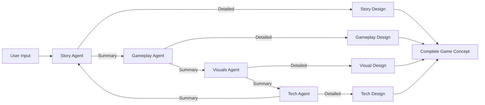

## Overview

The AI Game Design Agent Team is a collaborative game design system powered by AG2 (formerly AutoGen)'s AI Agent framework. This application generates comprehensive game concepts through the coordination of multiple specialized AI agents, each focusing on different aspects of game design based on user inputs such as game type, target audience, art style, and technical requirements. Built using AG2's swarm feature with the `initiate_swarm_chat()` method.

<Card title="Tutorial Available" icon="graduation-cap" href="https://www.theunwindai.com/p/build-an-ai-game-design-agent-team">
  Follow our complete step-by-step tutorial to build this from scratch
</Card>

## Architecture

### Swarm Orchestration Pattern

The Game Design Team uses AG2's **swarm pattern** for coordinated agent collaboration:



### Agent Roles

<AccordionGroup>
  <Accordion title="Story Agent" icon="book">
    **Specialization:** Narrative design and world-building
    
    **Responsibilities:**
    - Create compelling narratives aligned with game type
    - Design memorable characters with clear motivations
    - Develop game world, history, culture, and locations
    - Plan story progression and major plot points
    - Integrate narrative with mood/atmosphere
    - Support core gameplay mechanics through story
    
    **Outputs:**
    - Character development and arcs
    - Plot structure
    - Dialogue writing approach
    - Lore and world-building
  </Accordion>

  <Accordion title="Gameplay Agent" icon="gamepad">
    **Specialization:** Game mechanics and systems design
    
    **Responsibilities:**
    - Design core gameplay loops
    - Create progression systems (skills, abilities)
    - Define player interactions and controls
    - Balance gameplay for target audience
    - Design multiplayer interactions if applicable
    - Specify game modes and difficulty settings
    
    **Constraints Considered:**
    - Budget limitations
    - Development time
    - Platform capabilities
  </Accordion>

  <Accordion title="Visuals Agent" icon="palette">
    **Specialization:** Art direction and audio design
    
    **Responsibilities:**
    - Define visual style guide
    - Design character and environment aesthetics
    - Plan visual effects and animations
    - Create audio direction (music, SFX, ambient)
    - Consider platform technical constraints
    - Align visuals with mood/atmosphere
    
    **Deliverables:**
    - UI/UX design direction
    - Character art style
    - Environment art approach
    - Sound design framework
  </Accordion>

  <Accordion title="Tech Agent" icon="microchip">
    **Specialization:** Technical architecture and implementation
    
    **Responsibilities:**
    - Recommend game engine and tools
    - Define technical requirements per platform
    - Plan development pipeline and workflow
    - Identify technical challenges and solutions
    - Estimate resource requirements
    - Plan scalability and optimization
    - Design multiplayer infrastructure if needed
    
    **Considerations:**
    - Budget constraints
    - Team size
    - Timeline
    - Platform requirements
  </Accordion>

  <Accordion title="Task Agent (Coordinator)" icon="list-check">
    **Role:** Orchestration and integration
    
    **Responsibilities:**
    - Coordinate between specialized agents
    - Ensure cohesive integration of different aspects
    - Maintain consistency across designs
    - Manage agent handoffs
    - Aggregate final game concept
  </Accordion>
</AccordionGroup>

## Implementation

<Tabs>
  <Tab title="Swarm Agent Setup">
    ```python
    from autogen import (
        SwarmAgent,
        SwarmResult,
        initiate_swarm_chat,
        OpenAIWrapper,
        AFTER_WORK,
        UPDATE_SYSTEM_MESSAGE
    )

    # LLM Configuration
    llm_config = {
        "config_list": [{
            "model": "gpt-4o-mini",
            "api_key": api_key
        }]
    }

    # Context variables for agent communication
    context_variables = {
        "story": None,
        "gameplay": None,
        "visuals": None,
        "tech": None,
    }

    # Story Agent
    story_agent = SwarmAgent(
        "story_agent",
        llm_config=llm_config,
        functions=update_story_overview,
        update_agent_state_before_reply=[state_update]
    )

    # Gameplay Agent
    gameplay_agent = SwarmAgent(
        "gameplay_agent",
        llm_config=llm_config,
        functions=update_gameplay_overview,
        update_agent_state_before_reply=[state_update]
    )

    # Visuals Agent
    visuals_agent = SwarmAgent(
        "visuals_agent",
        llm_config=llm_config,
        functions=update_visuals_overview,
        update_agent_state_before_reply=[state_update]
    )

    # Tech Agent
    tech_agent = SwarmAgent(
        "tech_agent",
        llm_config=llm_config,
        functions=update_tech_overview,
        update_agent_state_before_reply=[state_update]
    )

    # Register handoffs (circular flow)
    story_agent.register_hand_off(AFTER_WORK(gameplay_agent))
    gameplay_agent.register_hand_off(AFTER_WORK(visuals_agent))
    visuals_agent.register_hand_off(AFTER_WORK(tech_agent))
    tech_agent.register_hand_off(AFTER_WORK(story_agent))
    ```
  </Tab>

  <Tab title="Agent Instructions">
    ```python
    system_messages = {
        "story_agent": """
        You are an experienced game story designer specializing in 
        narrative design and world-building. Your task is to:
        
        1. Create a compelling narrative that aligns with the 
           specified game type and target audience.
        2. Design memorable characters with clear motivations 
           and character arcs.
        3. Develop the game's world, including its history, 
           culture, and key locations.
        4. Plan story progression and major plot points.
        5. Integrate the narrative with the specified mood/atmosphere.
        6. Consider how the story supports the core gameplay mechanics.
        """,
        
        "gameplay_agent": """
        You are a senior game mechanics designer with expertise in 
        player engagement and systems design. Your task is to:
        
        1. Design core gameplay loops that match the specified 
           game type and mechanics.
        2. Create progression systems (character development, 
           skills, abilities).
        3. Define player interactions and control schemes for 
           the chosen perspective.
        4. Balance gameplay elements for the target audience.
        5. Design multiplayer interactions if applicable.
        6. Specify game modes and difficulty settings.
        7. Consider the budget and development time constraints.
        """,
        
        "visuals_agent": """
        You are a creative art director with expertise in game 
        visual and audio design. Your task is to:
        
        1. Define the visual style guide matching the specified art style.
        2. Design character and environment aesthetics.
        3. Plan visual effects and animations.
        4. Create the audio direction including music style, 
           sound effects, and ambient sound.
        5. Consider technical constraints of chosen platforms.
        6. Align visual elements with the game's mood/atmosphere.
        7. Work within the specified budget constraints.
        """,
        
        "tech_agent": """
        You are a technical director with extensive game development 
        experience. Your task is to:
        
        1. Recommend appropriate game engine and development tools.
        2. Define technical requirements for all target platforms.
        3. Plan the development pipeline and asset workflow.
        4. Identify potential technical challenges and solutions.
        5. Estimate resource requirements within the budget.
        6. Consider scalability and performance optimization.
        7. Plan for multiplayer infrastructure if applicable.
        """
    }
    ```
  </Tab>

  <Tab title="Update Functions">
    ```python
    # Functions for agent coordination and context sharing

    def update_story_overview(
        story_summary: str, 
        context_variables: dict
    ) -> SwarmResult:
        """Store story summary and hand off to gameplay agent."""
        context_variables["story"] = story_summary
        st.sidebar.success('Story overview: ' + story_summary)
        return SwarmResult(
            agent="gameplay_agent",
            context_variables=context_variables
        )

    def update_gameplay_overview(
        gameplay_summary: str, 
        context_variables: dict
    ) -> SwarmResult:
        """Store gameplay summary and hand off to visuals agent."""
        context_variables["gameplay"] = gameplay_summary
        st.sidebar.success('Gameplay overview: ' + gameplay_summary)
        return SwarmResult(
            agent="visuals_agent",
            context_variables=context_variables
        )

    def update_visuals_overview(
        visuals_summary: str, 
        context_variables: dict
    ) -> SwarmResult:
        """Store visuals summary and hand off to tech agent."""
        context_variables["visuals"] = visuals_summary
        st.sidebar.success('Visuals overview: ' + visuals_summary)
        return SwarmResult(
            agent="tech_agent",
            context_variables=context_variables
        )

    def update_tech_overview(
        tech_summary: str, 
        context_variables: dict
    ) -> SwarmResult:
        """Store tech summary and hand off back to story agent."""
        context_variables["tech"] = tech_summary
        st.sidebar.success('Tech overview: ' + tech_summary)
        return SwarmResult(
            agent="story_agent",
            context_variables=context_variables
        )
    ```
  </Tab>

  <Tab title="Swarm Execution">
    ```python
    # Execute swarm chat
    result, _, _ = initiate_swarm_chat(
        initial_agent=story_agent,
        agents=[story_agent, gameplay_agent, visuals_agent, tech_agent],
        user_agent=None,
        messages=task,
        max_rounds=13,  # 2 phases per agent + 1 initial
    )

    # Extract individual outputs
    output = {
        'story': result.chat_history[-4]['content'],
        'gameplay': result.chat_history[-3]['content'],
        'visuals': result.chat_history[-2]['content'],
        'tech': result.chat_history[-1]['content']
    }

    # Display in expandable sections
    with st.expander("Story Design"):
        st.markdown(output['story'])

    with st.expander("Gameplay Mechanics"):
        st.markdown(output['gameplay'])

    with st.expander("Visual and Audio Design"):
        st.markdown(output['visuals'])

    with st.expander("Technical Recommendations"):
        st.markdown(output['tech'])
    ```
  </Tab>

  <Tab title="Streamlit Interface">
    ```python
    import streamlit as st

    st.title("🎮 AI Game Design Agent Team")

    st.info("""
    **Meet Your AI Game Design Team:**
    
    🎭 **Story Agent** - Crafts compelling narratives
    🎮 **Gameplay Agent** - Creates engaging mechanics
    🎨 **Visuals Agent** - Shapes artistic vision
    ⚙️ **Tech Agent** - Provides technical direction
    """)

    # User inputs
    st.subheader("Game Details")
    col1, col2 = st.columns(2)

    with col1:
        background_vibe = st.text_input(
            "Background Vibe",
            "Epic fantasy with dragons"
        )
        game_type = st.selectbox(
            "Game Type",
            ["RPG", "Action", "Adventure", "Puzzle", 
             "Strategy", "Simulation", "Platform", "Horror"]
        )
        target_audience = st.selectbox(
            "Target Audience",
            ["Kids (7-12)", "Teens (13-17)", 
             "Young Adults (18-25)", "Adults (26+)", "All Ages"]
        )

    with col2:
        art_style = st.selectbox(
            "Art Style",
            ["Realistic", "Cartoon", "Pixel Art", "Stylized",
             "Low Poly", "Anime", "Hand-drawn"]
        )
        platform = st.multiselect(
            "Target Platforms",
            ["PC", "Mobile", "PlayStation", "Xbox",
             "Nintendo Switch", "Web Browser"]
        )
        development_time = st.slider(
            "Development Time (months)",
            1, 36, 12
        )

    if st.button("Generate Game Concept"):
        # Run swarm chat and display results
        pass
    ```
  </Tab>
</Tabs>

## Swarm Coordination Flow

### Two-Phase Agent Execution

Each agent goes through two phases:

<Steps>
  <Step title="Summary Phase">
    Agent provides 2-3 sentence summary of their design ideas
    
    ```python
    # Agent forced to call update function
    agent.llm_config['tool_choice'] = {
        "type": "function",
        "function": {"name": f"update_{agent_type}_overview"}
    }
    ```
  </Step>
  
  <Step title="Context Sharing">
    Summary stored in context_variables and shared with other agents
    
    ```python
    context_variables["story"] = story_summary
    # All subsequent agents can see this summary
    ```
  </Step>
  
  <Step title="Handoff">
    Agent hands off to next agent in sequence
    
    ```python
    return SwarmResult(
        agent="gameplay_agent",
        context_variables=context_variables
    )
    ```
  </Step>
  
  <Step title="Detailed Phase">
    After all agents provide summaries, each generates detailed design
    
    ```python
    # Tools removed, agent generates full response
    agent.llm_config["tools"] = None
    system_prompt += f"Write the {agent_type} part of the report."
    ```
  </Step>
</Steps>

### Context Accumulation

```python
# Each agent sees summaries from previous agents
system_prompt += f"\n\nContext for you to refer to:"

for k, v in agent._context_variables.items():
    if v is not None:
        system_prompt += f"\n{k.capitalize()} Summary:\n{v}"

# Example when Visuals Agent executes:
# - Has Story summary
# - Has Gameplay summary
# - Can design visuals that complement both
```

## Key Features

<CardGroup cols={2}>
  <Card title="Specialized Expertise" icon="users">
    Four specialized agents each bring domain expertise:
    - Story: Narrative design
    - Gameplay: Mechanics and systems
    - Visuals: Art and audio
    - Tech: Architecture and tools
  </Card>
  
  <Card title="Comprehensive Output" icon="file-lines">
    Complete game design documentation:
    - Narrative and world-building
    - Gameplay mechanics
    - Visual and audio direction
    - Technical specifications
    - Development roadmap
  </Card>
  
  <Card title="Customizable Input" icon="sliders">
    Extensive input parameters:
    - Game type and audience
    - Art style and platforms
    - Budget and timeline
    - Core mechanics
    - Mood and atmosphere
  </Card>
  
  <Card title="Interactive Results" icon="expand">
    User-friendly presentation:
    - Quick summaries in sidebar
    - Detailed expandable sections
    - Organized by design aspect
    - Easy navigation
  </Card>
</CardGroup>

## Input Parameters

<Tabs>
  <Tab title="Core Parameters">
    ```python
    # Essential game definition
    background_vibe = "Epic fantasy with dragons"
    game_type = "RPG"  # RPG, Action, Adventure, etc.
    game_goal = "Save the kingdom from eternal winter"
    target_audience = "Young Adults (18-25)"
    player_perspective = "Third Person"
    multiplayer = "Online Multiplayer"
    ```
  </Tab>
  
  <Tab title="Visual Parameters">
    ```python
    # Art and presentation
    art_style = "Stylized"  # Realistic, Cartoon, Pixel Art, etc.
    mood = ["Epic", "Mysterious", "Tense"]
    
    # Platform affects visual fidelity
    platform = ["PC", "PlayStation", "Xbox"]
    ```
  </Tab>
  
  <Tab title="Gameplay Parameters">
    ```python
    # Core mechanics and features
    core_mechanics = [
        "Combat",
        "Exploration",
        "Resource Management",
        "Crafting"
    ]
    
    # Additional features
    unique_features = "Dragon bonding system"
    ```
  </Tab>
  
  <Tab title="Development Parameters">
    ```python
    # Constraints and requirements
    development_time = 12  # months
    budget = 10000  # USD
    
    # Level of detail in response
    depth = "High"  # Low, Medium, High
    
    # Inspiration
    inspiration = "Skyrim, Dragon Age, The Witcher"
    ```
  </Tab>
</Tabs>

## Installation

<Steps>
  <Step title="Clone Repository">
    ```bash
    git clone https://github.com/Shubhamsaboo/awesome-llm-apps.git
    cd advanced_ai_agents/multi_agent_apps/agent_teams/ai_game_design_agent_team
    ```
  </Step>
  
  <Step title="Install Dependencies">
    ```bash
    pip install -r requirements.txt
    ```
    
    Required packages:
    - `streamlit==1.41.1`
    - `autogen`
  </Step>
  
  <Step title="Set OpenAI API Key">
    You'll input your OpenAI API key in the Streamlit sidebar
    
    Get your key from [platform.openai.com](https://platform.openai.com)
  </Step>
  
  <Step title="Run Application">
    ```bash
    streamlit run game_design_agent_team.py
    ```
  </Step>
</Steps>

## Usage Example

<Accordion title="Complete Game Design Output">
  **Input:**
  - Background: "Epic fantasy with dragons"
  - Type: RPG
  - Audience: Young Adults (18-25)
  - Art Style: Stylized
  - Platforms: PC, PlayStation, Xbox
  - Budget: $100,000
  - Time: 18 months

  **Story Design Output:**
  
  **World:** The kingdom of Aethermoor, where dragons and humans once lived in harmony
  
  **Protagonist:** Young dragon rider discovering ancient conspiracy
  
  **Narrative Arc:**
  - Act 1: Discovery and training
  - Act 2: Unraveling the curse
  - Act 3: Final confrontation with dark force
  
  **Key Characters:**
  - Mentor figure (tragic past)
  - Rival rider (becomes ally)
  - Ancient dragon (wisdom keeper)
  
  **Gameplay Design Output:**
  
  **Core Loop:**
  1. Explore regions
  2. Complete quests and challenges
  3. Strengthen dragon bond
  4. Unlock new abilities
  
  **Progression:**
  - Character leveling (1-50)
  - Dragon evolution stages
  - Skill trees for combat and magic
  - Equipment crafting system
  
  **Combat:**
  - Ground combat (swordplay and magic)
  - Aerial combat (dragon riding)
  - Combo system
  - Boss encounters
  
  **Visual Design Output:**
  
  **Art Direction:**
  - Stylized realism with painterly textures
  - Rich color palette (warm kingdoms, cool mountains)
  - Distinctive dragon designs per region
  
  **UI/UX:**
  - Minimalist HUD
  - Dragon bond indicator
  - Radial menu for abilities
  
  **Audio:**
  - Orchestral score with regional themes
  - Dynamic combat music
  - Dragon vocalizations
  
  **Technical Design Output:**
  
  **Engine:** Unreal Engine 5
  
  **Key Technologies:**
  - Nanite for environment detail
  - Niagara for dragon effects
  - MetaSounds for audio
  
  **Platform Requirements:**
  - PC: Medium-High settings, 16GB RAM
  - Consoles: Optimized 60fps mode
  
  **Development Pipeline:**
  - Months 1-3: Prototyping and core mechanics
  - Months 4-9: Content creation
  - Months 10-15: Polish and balancing
  - Months 16-18: Testing and optimization
</Accordion>

## Advanced Features

### Dynamic System Message Updates

```python
def update_system_message_func(agent: SwarmAgent, messages) -> str:
    """
    Dynamically update agent instructions based on phase.
    """
    system_prompt = system_messages[agent.name]
    current_gen = agent.name.split("_")[0]
    
    # Phase 1: Generate summary
    if agent._context_variables.get(current_gen) is None:
        system_prompt += f"Call the update function to provide "
                        f"a 2-3 sentence summary of your {current_gen} ideas."
        # Force function calling
        agent.llm_config['tool_choice'] = {
            "type": "function",
            "function": {"name": f"update_{current_gen}_overview"}
        }
    # Phase 2: Generate detailed design
    else:
        # Remove tools
        agent.llm_config["tools"] = None
        system_prompt += f"Write the {current_gen} part of the report."
        # Clear message history for cost savings
        k = list(agent._oai_messages.keys())[-1]
        agent._oai_messages[k] = agent._oai_messages[k][:1]
    
    # Add context from other agents
    system_prompt += "\n\nContext from other agents:"
    for k, v in agent._context_variables.items():
        if v is not None:
            system_prompt += f"\n{k.capitalize()}: {v}"
    
    agent.client = OpenAIWrapper(**agent.llm_config)
    return system_prompt
```

### Circular Handoff Pattern

```python
# Agents hand off in circular fashion
story_agent.register_hand_off(AFTER_WORK(gameplay_agent))
gameplay_agent.register_hand_off(AFTER_WORK(visuals_agent))
visuals_agent.register_hand_off(AFTER_WORK(tech_agent))
tech_agent.register_hand_off(AFTER_WORK(story_agent))

# Flow:
# Story → Gameplay → Visuals → Tech → Story (detailed) → etc.
```

## Best Practices

<AccordionGroup>
  <Accordion title="Input Quality">
    **Specific is Better:**
    - Provide detailed background vibe
    - List specific inspirations
    - Be clear about unique features
    - Specify technical constraints
    
    **Good Example:**
    ```
    Background: "Cyberpunk noir detective story in 
                rain-soaked neon city"
    Inspiration: "Blade Runner, Disco Elysium, Deus Ex"
    Unique: "Psychological interrogation system"
    ```
  </Accordion>
  
  <Accordion title="Parameter Balance">
    **Consider Constraints:**
    - Match scope to budget/time
    - Align complexity with team size
    - Choose appropriate platforms
    
    **Example:**
    - $10K budget → Pixel art, single platform, focused scope
    - $100K budget → Stylized 3D, multiple platforms, moderate scope
    - $1M+ budget → High-fidelity, all platforms, AAA features
  </Accordion>
  
  <Accordion title="Output Interpretation">
    **Review All Sections:**
    - Check consistency across agents
    - Verify technical feasibility
    - Assess scope vs. constraints
    - Look for creative synergies
    
    **Iterate:**
    - Run multiple times with variations
    - Adjust parameters based on output
    - Combine best ideas from runs
  </Accordion>
  
  <Accordion title="Cost Management">
    **Optimize Usage:**
    - Use gpt-4o-mini (default, cheaper)
    - Limit max_rounds to necessary amount
    - Clear message history between phases
    - Cache results for similar queries
    
    **Typical Costs:**
    - One complete run: ~$0.05-0.15
    - High detail setting: ~$0.20-0.30
  </Accordion>
</AccordionGroup>

## Technical Insights

### Why Swarm Pattern?

<Tabs>
  <Tab title="Benefits">
    **Coordination:**
    - Automatic agent handoffs
    - Context sharing built-in
    - Circular workflows supported
    
    **Flexibility:**
    - Dynamic system messages
    - Phase-based execution
    - Function-based transitions
    
    **Efficiency:**
    - Parallel processing potential
    - Message history management
    - Cost optimization
  </Tab>
  
  <Tab title="vs. Traditional Teams">
    **Traditional Team:**
    ```python
    # Sequential, manual coordination
    story = story_agent.run(task)
    gameplay = gameplay_agent.run(task + story)
    visuals = visuals_agent.run(task + story + gameplay)
    tech = tech_agent.run(task + story + gameplay + visuals)
    ```
    
    **Swarm Pattern:**
    ```python
    # Automatic coordination, context sharing
    result = initiate_swarm_chat(
        initial_agent=story_agent,
        agents=[story_agent, gameplay_agent, 
                visuals_agent, tech_agent],
        messages=task,
        max_rounds=13
    )
    ```
  </Tab>
  
  <Tab title="Performance">
    **Execution Time:**
    - Summary phase: ~20-30s per agent
    - Detailed phase: ~40-60s per agent
    - Total: ~4-6 minutes for complete design
    
    **Token Usage:**
    - Summary: ~500-1000 tokens per agent
    - Detailed: ~2000-4000 tokens per agent
    - Total: ~10K-20K tokens per run
    
    **Scalability:**
    - Add more agents easily
    - Adjust handoff patterns
    - Control depth dynamically
  </Tab>
</Tabs>

## Related Examples

<CardGroup cols={3}>
  <Card title="Mental Wellbeing Agent" icon="brain" href="/examples/mental-wellbeing-agent">
    Swarm pattern for mental health support
  </Card>
  <Card title="Legal Agent Team" icon="scale-balanced" href="/examples/legal-agent-team">
    Document analysis with team coordination
  </Card>
  <Card title="Finance Agent Team" icon="chart-line" href="/examples/finance-agent-team">
    Financial analysis with specialized agents
  </Card>
</CardGroup>