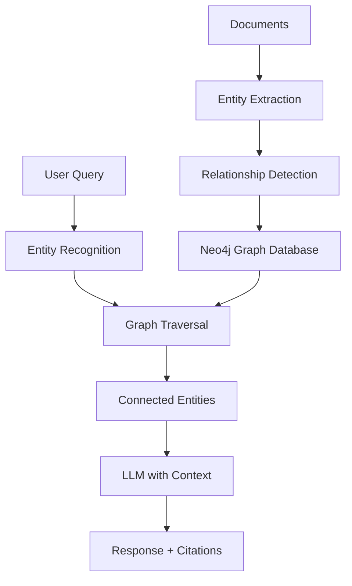

# Knowledge Graph RAG

Knowledge Graph RAG uses graph databases to represent relationships between entities, enabling more sophisticated retrieval based on connections and graph traversal.

## Overview

Knowledge Graph RAG features:
- **Entity extraction**: Identify key entities in documents
- **Relationship modeling**: Capture connections between entities
- **Graph traversal**: Navigate relationships for retrieval
- **Citation tracking**: Maintain source attribution

<CardGroup cols={2}>
  <Card title="Neo4j Integration" icon="diagram-project">
    Graph database for relationship storage and querying
  </Card>
  <Card title="Entity Recognition" icon="tags">
    Extract entities and relationships from documents
  </Card>
  <Card title="Cypher Queries" icon="code">
    Powerful graph query language for retrieval
  </Card>
  <Card title="Citation Graph" icon="link">
    Track and visualize source attribution
  </Card>
</CardGroup>

## Architecture



## Implementation

See the [Advanced RAG Techniques](/rag/advanced-techniques) page for complete knowledge graph RAG implementation with Neo4j.

## Key Components

### Entity Extraction

```python
from langchain.chains import create_extraction_chain
from langchain_openai import ChatOpenAI

llm = ChatOpenAI(model="gpt-4o", temperature=0)

schema = {
    "properties": {
        "entities": {"type": "array", "items": {"type": "string"}},
        "relationships": {"type": "array", "items": {
            "type": "object",
            "properties": {
                "source": {"type": "string"},
                "relation": {"type": "string"},
                "target": {"type": "string"}
            }
        }}
    }
}

extractor = create_extraction_chain(llm, schema)
result = extractor.run(document_text)
```

### Graph Storage

```python
from neo4j import GraphDatabase

class KnowledgeGraph:
    def __init__(self, uri, user, password):
        self.driver = GraphDatabase.driver(uri, auth=(user, password))
    
    def add_entity(self, entity_name, entity_type, source):
        with self.driver.session() as session:
            session.run(
                "MERGE (e:Entity {name: $name, type: $type, source: $source})",
                name=entity_name, type=entity_type, source=source
            )
    
    def add_relationship(self, source, relation, target):
        with self.driver.session() as session:
            session.run(
                """MATCH (s:Entity {name: $source})
                   MATCH (t:Entity {name: $target})
                   MERGE (s)-[r:RELATES {type: $relation}]->(t)""",
                source=source, relation=relation, target=target
            )
```

### Graph Retrieval

```python
def retrieve_with_context(query_entity, max_hops=2):
    with driver.session() as session:
        result = session.run(
            """MATCH path = (start:Entity {name: $entity})-[*1..$hops]-(end:Entity)
               RETURN path""",
            entity=query_entity, hops=max_hops
        )
        return [record["path"] for record in result]
```

## Benefits

<AccordionGroup>
  <Accordion title="Relationship-Aware Retrieval">
    - Find documents through entity connections
    - Discover indirect relationships
    - Navigate complex knowledge domains
    - Answer multi-hop reasoning questions
  </Accordion>
  
  <Accordion title="Citation Tracking">
    - Maintain source attribution in graph
    - Trace information back to original documents
    - Build citation networks
    - Verify claim provenance
  </Accordion>
  
  <Accordion title="Knowledge Exploration">
    - Visualize entity relationships
    - Discover unexpected connections
    - Navigate knowledge domains
    - Support exploratory analysis
  </Accordion>
</AccordionGroup>

## Use Cases

- **Research**: Navigate academic papers and citations
- **Legal**: Track case law relationships and precedents
- **Healthcare**: Connect symptoms, treatments, and outcomes
- **Business**: Map organizational relationships and dependencies

<Tip>
  Knowledge graphs excel when relationships between entities are as important as the entities themselves.
</Tip>

## Related Examples

<CardGroup cols={2}>
  <Card title="Advanced Techniques" icon="wand-magic-sparkles" href="/rag/advanced-techniques">
    Complete knowledge graph RAG implementation
  </Card>
  <Card title="Basic RAG" icon="layer-group" href="/examples/basic-rag-chain">
    Start with fundamental RAG patterns
  </Card>
</CardGroup>