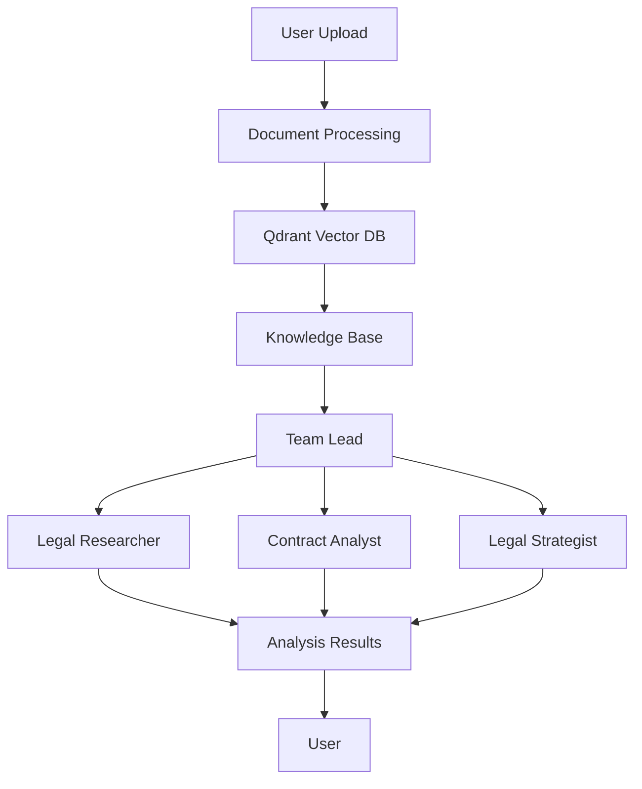

## Overview

The AI Legal Agent Team is a Streamlit application that simulates a full-service legal team using multiple AI agents to analyze legal documents and provide comprehensive legal insights. Each agent represents a different legal specialist role, from research and contract analysis to strategic planning, working together to provide thorough legal analysis and recommendations.

<Card title="Tutorial Available" icon="graduation-cap" href="https://www.theunwindai.com/p/build-an-ai-legal-team-run-by-ai-agents">
  Follow our complete step-by-step tutorial to build this from scratch
</Card>

## Architecture

### Multi-Agent Team Structure

The Legal Agent Team uses a **coordinated team pattern** with RAG (Retrieval-Augmented Generation) for document analysis:



### Agent Roles

<AccordionGroup>
  <Accordion title="Legal Researcher" icon="magnifying-glass">
    **Role:** Legal research specialist
    
    **Responsibilities:**
    - Find and cite relevant legal cases and precedents
    - Provide detailed research summaries with sources
    - Reference specific sections from uploaded documents
    - Search knowledge base for relevant information
    
    **Tools:**
    - DuckDuckGo search for case law and precedents
    - Knowledge base search
    
    **Model:** GPT-4o
  </Accordion>

  <Accordion title="Contract Analyst" icon="file-contract">
    **Role:** Contract analysis specialist
    
    **Responsibilities:**
    - Review contracts thoroughly
    - Identify key terms and potential issues
    - Reference specific clauses from documents
    - Analyze obligations and liabilities
    
    **Tools:**
    - Knowledge base search
    - Document reference
    
    **Model:** GPT-4o
  </Accordion>

  <Accordion title="Legal Strategist" icon="chess">
    **Role:** Legal strategy specialist
    
    **Responsibilities:**
    - Develop comprehensive legal strategies
    - Provide actionable recommendations
    - Consider both risks and opportunities
    - Assess compliance requirements
    
    **Tools:**
    - Knowledge base search
    - Strategic analysis frameworks
    
    **Model:** GPT-4o
  </Accordion>

  <Accordion title="Team Lead" icon="user-tie">
    **Role:** Coordination and synthesis
    
    **Responsibilities:**
    - Coordinate analysis between team members
    - Provide comprehensive responses
    - Ensure all recommendations are properly sourced
    - Reference specific parts of uploaded documents
    - Delegate tasks to appropriate specialists
    
    **Model:** GPT-4o
  </Accordion>
</AccordionGroup>

## Implementation

<Tabs>
  <Tab title="Agent Team Setup">
    ```python
    from agno.agent import Agent
    from agno.team import Team
    from agno.models.openai import OpenAIChat
    from agno.knowledge.knowledge import Knowledge
    from agno.vectordb.qdrant import Qdrant
    from agno.tools.duckduckgo import DuckDuckGoTools
    from agno.knowledge.embedder.openai import OpenAIEmbedder

    # Initialize Qdrant vector database
    vector_db = Qdrant(
        collection="legal_documents",
        url=qdrant_url,
        api_key=qdrant_api_key,
        embedder=OpenAIEmbedder(
            id="text-embedding-3-small",
            api_key=openai_api_key
        )
    )

    # Create knowledge base
    knowledge_base = Knowledge(vector_db=vector_db)
    knowledge_base.add_content(path=document_path)

    # Legal Researcher
    legal_researcher = Agent(
        name="Legal Researcher",
        role="Legal research specialist",
        model=OpenAIChat(id="gpt-4o"),
        tools=[DuckDuckGoTools()],
        knowledge=knowledge_base,
        search_knowledge=True,
        instructions=[
            "Find and cite relevant legal cases and precedents",
            "Provide detailed research summaries with sources",
            "Reference specific sections from the uploaded document",
            "Always search the knowledge base for relevant information"
        ],
        markdown=True
    )

    # Contract Analyst
    contract_analyst = Agent(
        name="Contract Analyst",
        role="Contract analysis specialist",
        model=OpenAIChat(id="gpt-4o"),
        knowledge=knowledge_base,
        search_knowledge=True,
        instructions=[
            "Review contracts thoroughly",
            "Identify key terms and potential issues",
            "Reference specific clauses from the document"
        ],
        markdown=True
    )

    # Legal Strategist
    legal_strategist = Agent(
        name="Legal Strategist",
        role="Legal strategy specialist",
        model=OpenAIChat(id="gpt-4o"),
        knowledge=knowledge_base,
        search_knowledge=True,
        instructions=[
            "Develop comprehensive legal strategies",
            "Provide actionable recommendations",
            "Consider both risks and opportunities"
        ],
        markdown=True
    )

    # Legal Agent Team
    legal_team = Team(
        name="Legal Team Lead",
        model=OpenAIChat(id="gpt-4o"),
        members=[legal_researcher, contract_analyst, legal_strategist],
        knowledge=knowledge_base,
        search_knowledge=True,
        instructions=[
            "Coordinate analysis between team members",
            "Provide comprehensive responses",
            "Ensure all recommendations are properly sourced",
            "Reference specific parts of the uploaded document",
            "Always search the knowledge base before delegating tasks"
        ],
        markdown=True
    )
    ```
  </Tab>

  <Tab title="Document Processing">
    ```python
    import tempfile
    import os
    from agno.knowledge.knowledge import Knowledge

    def process_document(uploaded_file, vector_db):
        """
        Process document, create embeddings and store in Qdrant.
        
        Args:
            uploaded_file: Streamlit uploaded file object
            vector_db: Initialized Qdrant instance
            
        Returns:
            Knowledge: Initialized knowledge base
        """
        # Save uploaded file temporarily
        with tempfile.NamedTemporaryFile(
            delete=False, 
            suffix='.pdf'
        ) as temp_file:
            temp_file.write(uploaded_file.getvalue())
            temp_file_path = temp_file.name
        
        # Create knowledge base
        knowledge_base = Knowledge(vector_db=vector_db)
        
        # Add document to knowledge base
        knowledge_base.add_content(path=temp_file_path)
        
        # Clean up temporary file
        os.unlink(temp_file_path)
        
        return knowledge_base
    ```
  </Tab>

  <Tab title="Analysis Types">
    ```python
    # Analysis configurations for different use cases
    analysis_configs = {
        "Contract Review": {
            "query": "Review this contract and identify key terms, "
                    "obligations, and potential issues.",
            "agents": ["Contract Analyst"],
            "description": "Detailed contract analysis focusing on "
                          "terms and obligations"
        },
        "Legal Research": {
            "query": "Research relevant cases and precedents "
                    "related to this document.",
            "agents": ["Legal Researcher"],
            "description": "Research on relevant legal cases "
                          "and precedents"
        },
        "Risk Assessment": {
            "query": "Analyze potential legal risks and "
                    "liabilities in this document.",
            "agents": ["Contract Analyst", "Legal Strategist"],
            "description": "Combined risk analysis and "
                          "strategic assessment"
        },
        "Compliance Check": {
            "query": "Check this document for regulatory "
                    "compliance issues.",
            "agents": ["Legal Researcher", "Contract Analyst", 
                      "Legal Strategist"],
            "description": "Comprehensive compliance analysis"
        },
        "Custom Query": {
            "query": None,
            "agents": ["Legal Researcher", "Contract Analyst", 
                      "Legal Strategist"],
            "description": "Custom analysis using all available agents"
        }
    }
    ```
  </Tab>

  <Tab title="Streamlit Interface">
    ```python
    import streamlit as st

    st.title("AI Legal Agent Team 👨‍⚖️")

    # Sidebar - API Configuration
    with st.sidebar:
        st.header("🔑 API Configuration")
        
        openai_key = st.text_input(
            "OpenAI API Key",
            type="password"
        )
        
        qdrant_key = st.text_input(
            "Qdrant API Key",
            type="password"
        )
        
        qdrant_url = st.text_input(
            "Qdrant URL"
        )
        
        st.divider()
        
        # Document upload
        st.header("📄 Document Upload")
        uploaded_file = st.file_uploader(
            "Upload Legal Document",
            type=['pdf']
        )
        
        st.divider()
        
        # Analysis options
        st.header("🔍 Analysis Options")
        analysis_type = st.selectbox(
            "Select Analysis Type",
            [
                "Contract Review",
                "Legal Research",
                "Risk Assessment",
                "Compliance Check",
                "Custom Query"
            ]
        )

    # Main content
    if st.button("Analyze"):
        # Process document and run analysis
        response = legal_team.run(query)
        
        # Display results in tabs
        tabs = st.tabs(["Analysis", "Key Points", "Recommendations"])
        
        with tabs[0]:
            st.markdown("### Detailed Analysis")
            st.markdown(response.content)
        
        with tabs[1]:
            st.markdown("### Key Points")
            # Extract key points
        
        with tabs[2]:
            st.markdown("### Recommendations")
            # Generate recommendations
    ```
  </Tab>
</Tabs>

## Document Analysis Types

<CardGroup cols={2}>
  <Card title="Contract Review" icon="file-contract">
    **Performed by:** Contract Analyst
    
    **Analysis includes:**
    - Key terms identification
    - Obligations and responsibilities
    - Potential issues and risks
    - Clause-by-clause review
    - Liability assessment
  </Card>
  
  <Card title="Legal Research" icon="book-open">
    **Performed by:** Legal Researcher
    
    **Analysis includes:**
    - Relevant case law
    - Legal precedents
    - Statutory references
    - Jurisdictional considerations
    - Citation summaries
  </Card>
  
  <Card title="Risk Assessment" icon="triangle-exclamation">
    **Performed by:** Contract Analyst + Legal Strategist
    
    **Analysis includes:**
    - Legal risk identification
    - Liability exposure
    - Compliance gaps
    - Mitigation strategies
    - Risk prioritization
  </Card>
  
  <Card title="Compliance Check" icon="clipboard-check">
    **Performed by:** All Agents
    
    **Analysis includes:**
    - Regulatory compliance
    - Industry standards
    - Legal requirements
    - Best practices
    - Remediation steps
  </Card>
</CardGroup>

## Key Features

### RAG-Powered Analysis

<Steps>
  <Step title="Document Upload">
    User uploads PDF legal document through Streamlit interface
  </Step>
  
  <Step title="Embedding Creation">
    Document is chunked and embedded using OpenAI's `text-embedding-3-small` model
  </Step>
  
  <Step title="Vector Storage">
    Embeddings stored in Qdrant vector database for semantic search
  </Step>
  
  <Step title="Knowledge Base">
    All agents have access to the knowledge base for document references
  </Step>
  
  <Step title="Semantic Search">
    Agents search knowledge base to find relevant document sections
  </Step>
  
  <Step title="Grounded Analysis">
    Analysis grounded in actual document content with specific citations
  </Step>
</Steps>

### Team Coordination

```python
# Query routing example
if analysis_type == "Contract Review":
    # Routes to Contract Analyst
    focus_agents = ["Contract Analyst"]
elif analysis_type == "Legal Research":
    # Routes to Legal Researcher
    focus_agents = ["Legal Researcher"]
elif analysis_type == "Risk Assessment":
    # Uses both Contract Analyst and Legal Strategist
    focus_agents = ["Contract Analyst", "Legal Strategist"]
else:
    # Uses all agents
    focus_agents = ["Legal Researcher", "Contract Analyst", "Legal Strategist"]

# Team Lead coordinates agent collaboration
response = legal_team.run(query)
```

## Installation

<Steps>
  <Step title="Clone Repository">
    ```bash
    git clone https://github.com/Shubhamsaboo/awesome-llm-apps.git
    cd advanced_ai_agents/multi_agent_apps/agent_teams/ai_legal_agent_team
    ```
  </Step>
  
  <Step title="Install Dependencies">
    ```bash
    pip install -r requirements.txt
    ```
    
    Required packages:
    - `agno>=2.2.10`
    - `streamlit`
    - `qdrant-client`
    - `openai`
    - `pypdf`
    - `duckduckgo-search`
  </Step>
  
  <Step title="Configure API Keys">
    Get your API keys:
    - OpenAI: [platform.openai.com](https://platform.openai.com)
    - Qdrant: [cloud.qdrant.io](https://cloud.qdrant.io)
  </Step>
  
  <Step title="Run Application">
    ```bash
    streamlit run legal_agent_team.py
    ```
  </Step>
</Steps>

## Usage Examples

<AccordionGroup>
  <Accordion title="Contract Review Example">
    **Document:** Employment Agreement
    
    **Query:** "Review this employment contract"
    
    **Contract Analyst Analysis:**
    
    **Key Terms Identified:**
    - Employment term: 2 years (Section 2.1)
    - Compensation: $150,000 annual salary (Section 3.1)
    - Non-compete: 12 months post-termination (Section 8.2)
    - Confidentiality obligations (Section 9)
    
    **Potential Issues:**
    - Non-compete clause may be overly broad
    - Termination provisions favor employer
    - Intellectual property assignment is comprehensive
    
    **Recommendations:**
    - Negotiate narrower non-compete scope
    - Request severance provisions
    - Clarify IP rights for prior work
  </Accordion>

  <Accordion title="Risk Assessment Example">
    **Document:** Software License Agreement
    
    **Query:** "Assess legal risks in this agreement"
    
    **Contract Analyst + Legal Strategist Analysis:**
    
    **High Risk Items:**
    1. Unlimited liability for data breaches (Section 12.3)
    2. Broad indemnification obligations (Section 11)
    3. Automatic renewal with difficult opt-out (Section 4.2)
    
    **Medium Risk Items:**
    1. Unilateral modification rights (Section 15.1)
    2. Broad audit rights (Section 7.4)
    
    **Mitigation Strategies:**
    - Cap liability at 12 months of fees
    - Limit indemnification to direct damages
    - Require 90-day renewal notice
    - Add mutual modification consent
  </Accordion>

  <Accordion title="Compliance Check Example">
    **Document:** Data Processing Agreement
    
    **Query:** "Check GDPR compliance"
    
    **All Agents Analysis:**
    
    **Legal Researcher:**
    - Reviews GDPR requirements (Articles 28, 32)
    - Checks relevant case law and guidance
    - Identifies applicable data protection laws
    
    **Contract Analyst:**
    - Verifies required GDPR clauses present
    - Checks data subject rights provisions
    - Reviews security obligation specificity
    
    **Legal Strategist:**
    - Assesses overall compliance posture
    - Identifies compliance gaps
    - Recommends remediation steps
    
    **Findings:**
    ✅ Data processing purposes clearly defined
    ✅ Sub-processor provisions included
    ❌ Missing specific security measures (Article 32)
    ❌ Data subject rights procedures incomplete
    ⚠️ Data retention periods not specified
  </Accordion>
</AccordionGroup>

## Technical Architecture

### Vector Database Integration

```python
from agno.vectordb.qdrant import Qdrant
from agno.knowledge.embedder.openai import OpenAIEmbedder

# Initialize Qdrant with OpenAI embeddings
vector_db = Qdrant(
    collection="legal_documents",
    url=qdrant_url,
    api_key=qdrant_api_key,
    embedder=OpenAIEmbedder(
        id="text-embedding-3-small",  # 1536 dimensions
        api_key=openai_api_key
    )
)

# Benefits:
# - Semantic search across documents
# - Efficient similarity matching
# - Scalable to large document sets
# - Fast retrieval (<100ms)
```

### Knowledge Base Search

```python
# Agents automatically search knowledge base
search_knowledge=True

# Search flow:
# 1. Agent receives query
# 2. Query embedded using same model
# 3. Semantic search in vector DB
# 4. Top relevant chunks retrieved
# 5. Chunks added to agent context
# 6. Agent generates grounded response
```

### Multi-Tab Results

```python
# Structured output in three tabs
tabs = st.tabs(["Analysis", "Key Points", "Recommendations"])

with tabs[0]:
    # Detailed analysis from team
    st.markdown(response.content)

with tabs[1]:
    # Extracted key points
    key_points = legal_team.run(
        f"Summarize key points from: {response.content}"
    )
    st.markdown(key_points.content)

with tabs[2]:
    # Strategic recommendations
    recommendations = legal_team.run(
        f"Provide key recommendations based on: {response.content}"
    )
    st.markdown(recommendations.content)
```

## Best Practices

<CardGroup cols={2}>
  <Card title="Document Preparation" icon="file-pdf">
    - Use clear, searchable PDFs
    - Ensure text is extractable (not scanned images)
    - Remove unnecessary pages
    - Organize multi-document reviews
  </Card>
  
  <Card title="Query Formulation" icon="message">
    - Be specific about what you need
    - Reference specific sections when applicable
    - Ask follow-up questions for clarity
    - Combine analysis types as needed
  </Card>
  
  <Card title="Result Interpretation" icon="chart-mixed">
    - Review all three tabs (Analysis, Key Points, Recommendations)
    - Cross-reference with original document
    - Verify agent citations
    - Consider context and jurisdiction
  </Card>
  
  <Card title="Privacy & Security" icon="shield-halved">
    - Use private Qdrant instance
    - Review OpenAI data policies
    - Don't upload highly sensitive documents
    - Clear data after analysis if needed
  </Card>
</CardGroup>

<Warning>
  **Important Legal Disclaimer:**
  
  This application is a supportive tool and does not replace professional legal counsel. 
  - Analysis is for informational purposes only
  - Not a substitute for licensed attorney advice
  - Always verify critical legal matters with qualified professionals
  - Consider jurisdiction-specific requirements
  - AI may miss nuanced legal issues
</Warning>

## Advanced Features

### Custom Query Mode

For specialized analysis beyond predefined types:

```python
# Example custom queries
"Identify force majeure clauses and assess their scope"
"Compare this agreement's IP provisions with industry standards"
"Analyze dispute resolution mechanisms and suggest improvements"
"Review termination rights and assess balance between parties"
```

### Multi-Document Analysis

```python
# Process multiple related documents
documents = ["agreement.pdf", "amendment_1.pdf", "amendment_2.pdf"]

for doc in documents:
    knowledge_base.add_content(path=doc)

# Agents can now search across all documents
query = "Compare obligations across all amendments"
```

## Performance Considerations

<Tabs>
  <Tab title="Processing Speed">
    - Document upload: ~5-10 seconds
    - Embedding creation: ~2-5 seconds per page
    - Vector storage: ~1-2 seconds
    - Agent analysis: ~30-60 seconds
    - Follow-up queries: ~20-30 seconds (cached embeddings)
  </Tab>
  
  <Tab title="Cost Optimization">
    - Embeddings: ~$0.0001 per page (one-time)
    - Agent queries: ~$0.03-0.10 per analysis (GPT-4o)
    - Vector storage: ~$0.01 per month (Qdrant free tier)
    - Reuse embeddings for multiple queries
    - Batch similar analyses
  </Tab>
  
  <Tab title="Scalability">
    - Handles documents up to 100+ pages
    - Multiple documents in single knowledge base
    - Qdrant scales to millions of vectors
    - Parallel agent processing
    - Session state management
  </Tab>
</Tabs>

## Related Examples

<CardGroup cols={3}>
  <Card title="Finance Agent Team" icon="chart-line" href="/examples/finance-agent-team">
    Financial analysis with agent teams
  </Card>
  <Card title="Game Design Team" icon="gamepad" href="/examples/game-design-team">
    Collaborative game design agents
  </Card>
  <Card title="Deep Research Agent" icon="magnifying-glass" href="/examples/deep-research-agent">
    Comprehensive research capabilities
  </Card>
</CardGroup>