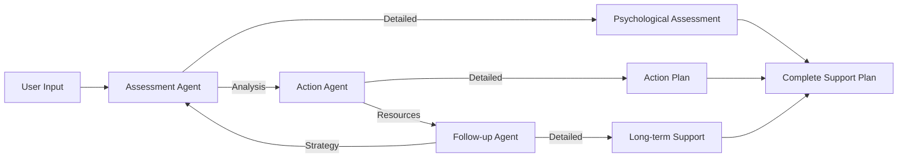

## Overview

The AI Mental Wellbeing Agent Team is a supportive mental health assessment and guidance system powered by AG2 (formerly AutoGen)'s AI Agent framework. This application provides personalized mental health support through the coordination of specialized AI agents, each focusing on different aspects of mental health care based on user inputs such as emotional state, stress levels, sleep patterns, and current symptoms. Built using AG2's swarm feature with the `initiate_swarm_chat()` method.

<Warning>
  **Important Notice**
  
  This application is a supportive tool and does not replace professional mental health care. If you're experiencing thoughts of self-harm or severe crisis:
  
  - Call National Crisis Hotline: **988**
  - Call Emergency Services: **911**
  - Seek immediate professional help
</Warning>

## Architecture

### Swarm Orchestration Pattern

The Mental Wellbeing Team uses AG2's **swarm pattern** for coordinated therapeutic support:



### Agent Roles

<CardGroup cols={3}>
  <Card title="Assessment Agent" icon="clipboard-check">
    **Role:** Psychological assessment specialist
    
    **Approach:**
    - Clinical precision with empathy
    - Safe space creation
    - Pattern identification
    - Risk assessment
    - Validation without minimizing
  </Card>
  
  <Card title="Action Agent" icon="list-check">
    **Role:** Crisis intervention and resources
    
    **Approach:**
    - Immediate coping strategies
    - Intervention prioritization
    - Resource connections
    - Daily wellness plans
    - Empowerment techniques
  </Card>
  
  <Card title="Follow-up Agent" icon="calendar-days">
    **Role:** Long-term recovery planning
    
    **Approach:**
    - Sustainable strategies
    - Progress monitoring
    - Relapse prevention
    - Maintenance schedules
    - Self-compassion focus
  </Card>
</CardGroup>

## Implementation

<Tabs>
  <Tab title="Swarm Agent Setup">
    ```python
    from autogen import (
        SwarmAgent,
        SwarmResult,
        initiate_swarm_chat,
        OpenAIWrapper,
        AFTER_WORK,
        UPDATE_SYSTEM_MESSAGE
    )
    import os

    # Disable Docker requirement
    os.environ["AUTOGEN_USE_DOCKER"] = "0"

    # LLM Configuration
    llm_config = {
        "config_list": [{
            "model": "gpt-4o",
            "api_key": api_key
        }]
    }

    # Context variables for agent coordination
    context_variables = {
        "assessment": None,
        "action": None,
        "followup": None,
    }

    # Assessment Agent
    assessment_agent = SwarmAgent(
        "assessment_agent",
        llm_config=llm_config,
        functions=update_assessment_overview,
        update_agent_state_before_reply=[state_update]
    )

    # Action Agent
    action_agent = SwarmAgent(
        "action_agent",
        llm_config=llm_config,
        functions=update_action_overview,
        update_agent_state_before_reply=[state_update]
    )

    # Follow-up Agent
    followup_agent = SwarmAgent(
        "followup_agent",
        llm_config=llm_config,
        functions=update_followup_overview,
        update_agent_state_before_reply=[state_update]
    )

    # Register handoffs (circular flow)
    assessment_agent.register_hand_off(AFTER_WORK(action_agent))
    action_agent.register_hand_off(AFTER_WORK(followup_agent))
    followup_agent.register_hand_off(AFTER_WORK(assessment_agent))
    ```
  </Tab>

  <Tab title="Agent Instructions">
    ```python
    system_messages = {
        "assessment_agent": """
        You are an experienced mental health professional speaking 
        directly to the user. Your task is to:
        
        1. Create a safe space by acknowledging their courage 
           in seeking support
        2. Analyze their emotional state with clinical precision 
           and genuine empathy
        3. Ask targeted follow-up questions to understand 
           their full situation
        4. Identify patterns in their thoughts, behaviors, 
           and relationships
        5. Assess risk levels with validated screening approaches
        6. Help them understand their current mental health 
           in accessible language
        7. Validate their experiences without minimizing 
           or catastrophizing
        
        Always use "you" and "your" when addressing the user. 
        Blend clinical expertise with genuine warmth and never 
        rush to conclusions.
        """,
        
        "action_agent": """
        You are a crisis intervention and resource specialist 
        speaking directly to the user. Your task is to:
        
        1. Provide immediate evidence-based coping strategies 
           tailored to their specific situation
        2. Prioritize interventions based on urgency and effectiveness
        3. Connect them with appropriate mental health services 
           while acknowledging barriers (cost, access, stigma)
        4. Create a concrete daily wellness plan with specific 
           times and activities
        5. Suggest specific support communities with details 
           on how to join
        6. Balance crisis resources with empowerment techniques
        7. Teach simple self-regulation techniques they can 
           use immediately
        
        Focus on practical, achievable steps that respect their 
        current capacity and energy levels. Provide options ranging 
        from minimal effort to more involved actions.
        """,
        
        "followup_agent": """
        You are a mental health recovery planner speaking directly 
        to the user. Your task is to:
        
        1. Design a personalized long-term support strategy 
           with milestone markers
        2. Create a progress monitoring system that matches 
           their preferences and habits
        3. Develop specific relapse prevention strategies based 
           on their unique triggers
        4. Establish a support network mapping exercise to 
           identify existing resources
        5. Build a graduated self-care routine that evolves 
           with their recovery
        6. Plan for setbacks with self-compassion techniques
        7. Set up a maintenance schedule with clear check-in 
           mechanisms
        
        Focus on building sustainable habits that integrate with 
        their lifestyle and values. Emphasize progress over 
        perfection and teach skills for self-directed care.
        """
    }
    ```
  </Tab>

  <Tab title="Update Functions">
    ```python
    # Functions for agent coordination

    def update_assessment_overview(
        assessment_summary: str,
        context_variables: dict
    ) -> SwarmResult:
        """Store assessment and hand off to action agent."""
        context_variables["assessment"] = assessment_summary
        st.sidebar.success('Assessment: ' + assessment_summary)
        return SwarmResult(
            agent="action_agent",
            context_variables=context_variables
        )

    def update_action_overview(
        action_summary: str,
        context_variables: dict
    ) -> SwarmResult:
        """Store action plan and hand off to follow-up agent."""
        context_variables["action"] = action_summary
        st.sidebar.success('Action Plan: ' + action_summary)
        return SwarmResult(
            agent="followup_agent",
            context_variables=context_variables
        )

    def update_followup_overview(
        followup_summary: str,
        context_variables: dict
    ) -> SwarmResult:
        """Store follow-up strategy and complete cycle."""
        context_variables["followup"] = followup_summary
        st.sidebar.success('Follow-up Strategy: ' + followup_summary)
        return SwarmResult(
            agent="assessment_agent",
            context_variables=context_variables
        )
    ```
  </Tab>

  <Tab title="Swarm Execution">
    ```python
    # Prepare user task
    task = f"""
    Create a comprehensive mental health support plan based on:
    
    Emotional State: {mental_state}
    Sleep: {sleep_pattern} hours per night
    Stress Level: {stress_level}/10
    Support System: {', '.join(support_system)}
    Recent Changes: {recent_changes}
    Current Symptoms: {', '.join(current_symptoms)}
    """

    # Execute swarm chat
    result, _, _ = initiate_swarm_chat(
        initial_agent=assessment_agent,
        agents=[assessment_agent, action_agent, followup_agent],
        user_agent=None,
        messages=task,
        max_rounds=13,  # 2 phases per agent + initial
    )

    # Extract outputs
    output = {
        'assessment': result.chat_history[-3]['content'],
        'action': result.chat_history[-2]['content'],
        'followup': result.chat_history[-1]['content']
    }

    # Display in expandable sections
    with st.expander("Situation Assessment"):
        st.markdown(output['assessment'])

    with st.expander("Action Plan & Resources"):
        st.markdown(output['action'])

    with st.expander("Long-term Support Strategy"):
        st.markdown(output['followup'])
    ```
  </Tab>

  <Tab title="Streamlit Interface">
    ```python
    import streamlit as st

    st.title("🧠 Mental Wellbeing Agent")

    st.info("""
    **Meet Your Mental Wellbeing Agent Team:**
    
    🧠 **Assessment Agent** - Analyzes your situation and needs
    🎯 **Action Agent** - Creates immediate action plan
    🔄 **Follow-up Agent** - Designs long-term support strategy
    """)

    # User inputs
    st.subheader("Personal Information")
    col1, col2 = st.columns(2)

    with col1:
        mental_state = st.text_area(
            "How have you been feeling recently?",
            placeholder="Describe your emotional state..."
        )
        sleep_pattern = st.select_slider(
            "Sleep Pattern (hours per night)",
            options=[f"{i}" for i in range(0, 13)],
            value="7"
        )

    with col2:
        stress_level = st.slider(
            "Current Stress Level (1-10)",
            1, 10, 5
        )
        support_system = st.multiselect(
            "Current Support System",
            ["Family", "Friends", "Therapist", 
             "Support Groups", "None"]
        )

    recent_changes = st.text_area(
        "Any significant life changes recently?",
        placeholder="Job changes, relationships, losses..."
    )

    current_symptoms = st.multiselect(
        "Current Symptoms",
        ["Anxiety", "Depression", "Insomnia", "Fatigue",
         "Loss of Interest", "Difficulty Concentrating",
         "Changes in Appetite", "Social Withdrawal",
         "Mood Swings", "Physical Discomfort"]
    )

    if st.button("Get Support Plan"):
        # Execute swarm and display results
        pass
    ```
  </Tab>
</Tabs>

## Agent Coordination Flow

<Steps>
  <Step title="Assessment Phase">
    **Assessment Agent** analyzes the user's situation:
    - Reviews emotional state and symptoms
    - Identifies patterns and risk factors
    - Validates experiences with empathy
    - Provides 2-3 sentence summary
    
    Hands off to Action Agent with context
  </Step>
  
  <Step title="Action Phase">
    **Action Agent** creates immediate support:
    - Develops evidence-based coping strategies
    - Connects with appropriate resources
    - Creates daily wellness plan
    - Suggests support communities
    - Provides 2-3 sentence summary
    
    Hands off to Follow-up Agent with context
  </Step>
  
  <Step title="Follow-up Phase">
    **Follow-up Agent** designs long-term strategy:
    - Creates personalized support plan
    - Establishes progress monitoring
    - Develops relapse prevention strategies
    - Builds sustainable self-care routine
    - Provides 2-3 sentence summary
    
    Completes cycle with full context
  </Step>
  
  <Step title="Detailed Generation">
    Each agent generates comprehensive report:
    - Assessment: Full psychological analysis
    - Action: Detailed coping strategies and resources
    - Follow-up: Complete long-term recovery plan
  </Step>
</Steps>

## Key Features

<AccordionGroup>
  <Accordion title="Comprehensive Assessment" icon="clipboard-check">
    **Clinical Precision:**
    - Emotional state analysis
    - Pattern identification in thoughts and behaviors
    - Risk assessment using validated approaches
    - Relationship dynamics evaluation
    
    **Empathetic Approach:**
    - Creates safe space for sharing
    - Acknowledges courage in seeking help
    - Validates experiences without judgment
    - Uses accessible, non-clinical language
  </Accordion>

  <Accordion title="Immediate Action Plans" icon="list-check">
    **Evidence-Based Strategies:**
    - Tailored coping techniques
    - Self-regulation exercises
    - Crisis management approaches
    - Grounding and mindfulness practices
    
    **Practical Resources:**
    - Mental health services connections
    - Support community recommendations
    - Concrete daily wellness plans
    - Specific times and activities
    - Options for varying energy levels
  </Accordion>

  <Accordion title="Long-term Support" icon="calendar-days">
    **Personalized Strategy:**
    - Milestone markers for progress
    - Monitoring systems matched to preferences
    - Relapse prevention based on triggers
    - Support network mapping
    
    **Sustainable Habits:**
    - Graduated self-care routines
    - Integration with lifestyle and values
    - Progress over perfection emphasis
    - Self-compassion techniques
    - Regular check-in mechanisms
  </Accordion>

  <Accordion title="Interactive Results" icon="expand">
    **User-Friendly Presentation:**
    - Real-time summaries in sidebar
    - Detailed expandable sections
    - Clear action steps
    - Organized by support phase
    - Easy to save and reference
  </Accordion>
</AccordionGroup>

## Input Parameters

<Tabs>
  <Tab title="Emotional State">
    ```python
    # Free-form emotional description
    mental_state = st.text_area(
        "How have you been feeling recently?",
        placeholder="Describe your emotional state, "
                   "thoughts, or concerns..."
    )
    
    # Captures:
    # - Current feelings and moods
    # - Recurring thoughts
    # - Concerns and worries
    # - Recent experiences
    # - Changes in emotional state
    ```
  </Tab>
  
  <Tab title="Physical Indicators">
    ```python
    # Sleep patterns
    sleep_pattern = st.select_slider(
        "Sleep Pattern (hours per night)",
        options=[f"{i}" for i in range(0, 13)],
        value="7"
    )
    
    # Current symptoms
    current_symptoms = st.multiselect(
        "Current Symptoms",
        [
            "Anxiety",
            "Depression",
            "Insomnia",
            "Fatigue",
            "Loss of Interest",
            "Difficulty Concentrating",
            "Changes in Appetite",
            "Social Withdrawal",
            "Mood Swings",
            "Physical Discomfort"
        ]
    )
    ```
  </Tab>
  
  <Tab title="Stress & Support">
    ```python
    # Stress assessment
    stress_level = st.slider(
        "Current Stress Level (1-10)",
        1, 10, 5
    )
    
    # Available support
    support_system = st.multiselect(
        "Current Support System",
        [
            "Family",
            "Friends",
            "Therapist",
            "Support Groups",
            "None"
        ]
    )
    ```
  </Tab>
  
  <Tab title="Life Context">
    ```python
    # Recent changes
    recent_changes = st.text_area(
        "Any significant life changes recently?",
        placeholder="Job changes, relationships, "
                   "losses, etc..."
    )
    
    # Helps identify:
    # - Potential triggers
    # - Context for current state
    # - Environmental stressors
    # - Life transitions
    # - Major events
    ```
  </Tab>
</Tabs>

## Installation

<Steps>
  <Step title="Clone Repository">
    ```bash
    git clone https://github.com/Shubhamsaboo/awesome-llm-apps.git
    cd advanced_ai_agents/multi_agent_apps/ai_mental_wellbeing_agent
    ```
  </Step>
  
  <Step title="Install Dependencies">
    ```bash
    pip install -r requirements.txt
    ```
    
    Required packages:
    - `autogen-agentchat`
    - `autogen-ext`
    - `pyautogen`
    - `streamlit`
  </Step>
  
  <Step title="Create Environment File">
    ```bash
    echo "AUTOGEN_USE_DOCKER=0" > .env
    ```
    
    This disables Docker requirement for code execution
  </Step>
  
  <Step title="Set OpenAI API Key">
    You'll input your OpenAI API key in the Streamlit sidebar
    
    Get your key from [platform.openai.com](https://platform.openai.com)
  </Step>
  
  <Step title="Run Application">
    ```bash
    streamlit run ai_mental_wellbeing_agent.py
    ```
  </Step>
</Steps>

## Usage Example

<Accordion title="Complete Support Plan Output">
  **User Input:**
  - Emotional State: "Feeling overwhelmed, anxious about work, trouble sleeping"
  - Sleep: 4-5 hours per night
  - Stress Level: 8/10
  - Support System: Family, Friends
  - Recent Changes: "New job, moved to new city"
  - Symptoms: Anxiety, Insomnia, Difficulty Concentrating

  **Assessment Agent Output:**
  
  Thank you for having the courage to reach out. What you're experiencing is a very real response to significant life transitions. Moving to a new city and starting a new job are both major stressors, and when combined, they can feel overwhelming.
  
  **What I'm Noticing:**
  - Your body is showing clear signs of stress (poor sleep, difficulty concentrating)
  - Anxiety levels are significantly elevated (8/10)
  - You have important support systems (family, friends) which is a strength
  - Sleep deprivation is likely amplifying other symptoms
  
  **Risk Assessment:**
  Moderate stress response to life transitions. No immediate crisis indicators, but intervention needed to prevent escalation.
  
  **Action Agent Output:**
  
  Let's create an immediate action plan that's realistic for your current energy level:
  
  **Tonight (Minimal Effort):**
  1. Set phone alarm for same bedtime (10:30 PM)
  2. Dim lights 1 hour before bed
  3. Try 4-7-8 breathing: Breathe in for 4, hold for 7, out for 8 (4 times)
  
  **This Week (Moderate Effort):**
  1. Schedule one 20-minute walk daily (morning preferred)
  2. Text one friend/family member each day
  3. Keep a "worry dump" journal before bed
  
  **Resources:**
  - **BetterHelp** or **Talkspace**: Online therapy ($60-90/week)
  - **Headspace** app: Guided meditation free trial
  - **City-specific meetups**: Search "[Your City] newcomers group"
  
  **Crisis Resources:**
  - National Crisis Hotline: 988 (24/7, free)
  - Crisis Text Line: Text HOME to 741741
  
  **Follow-up Agent Output:**
  
  Let's build a sustainable recovery plan:
  
  **Week 1-2: Foundation**
  - Primary goal: Sleep regulation
  - Track: Sleep hours, anxiety level (1-10 scale)
  - Milestone: 6+ hours sleep for 3 consecutive nights
  
  **Week 3-4: Building Routine**
  - Add: Weekly social activity
  - Continue: Sleep hygiene, daily walks
  - Milestone: Stress level below 6/10
  
  **Week 5-8: Connection**
  - Join: One local interest group
  - Establish: Weekly friend check-in
  - Milestone: Feeling "somewhat settled" in new city
  
  **Relapse Prevention:**
  Your triggers appear to be: uncertainty, social isolation, work pressure
  
  When you notice these, immediately:
  1. Use 4-7-8 breathing (3 rounds)
  2. Text your support system
  3. Take a 10-minute walk
  
  **Monthly Check-ins:**
  - 1st of month: Review sleep tracker
  - 15th of month: Assess stress level
  - End of month: Celebrate one accomplishment
</Accordion>

## Technical Architecture

### Two-Phase Execution

```python
def update_system_message_func(agent: SwarmAgent, messages) -> str:
    system_prompt = system_messages[agent.name]
    current_gen = agent.name.split("_")[0]
    
    # Phase 1: Generate summary
    if agent._context_variables.get(current_gen) is None:
        system_prompt += f"""Call the update function to provide 
                            a 2-3 sentence summary of your {current_gen} 
                            based on the context."""
        agent.llm_config['tool_choice'] = {
            "type": "function",
            "function": {"name": f"update_{current_gen}_overview"}
        }
    # Phase 2: Generate detailed response
    else:
        agent.llm_config["tools"] = None
        agent.llm_config['tool_choice'] = None
        system_prompt += f"""Write the {current_gen} part of the report.
                            Start with: '## {current_gen.capitalize()} Design'"""
        # Clear message history for efficiency
        k = list(agent._oai_messages.keys())[-1]
        agent._oai_messages[k] = agent._oai_messages[k][:1]
    
    # Add context from other agents
    system_prompt += "\n\nContext from other agents:"
    for k, v in agent._context_variables.items():
        if v is not None:
            system_prompt += f"\n{k.capitalize()} Summary:\n{v}"
    
    agent.client = OpenAIWrapper(**agent.llm_config)
    return system_prompt
```

### Context Accumulation

```python
# Action Agent sees Assessment Agent's summary
context_variables = {
    "assessment": "User experiencing moderate stress from life transitions...",
    "action": None,  # Not yet generated
    "followup": None
}

# Follow-up Agent sees both previous summaries
context_variables = {
    "assessment": "User experiencing moderate stress...",
    "action": "Immediate sleep hygiene and breathing exercises...",
    "followup": None  # Not yet generated
}
```

## Best Practices

<CardGroup cols={2}>
  <Card title="Honest Input" icon="heart">
    - Be truthful about your feelings
    - Share relevant context
    - Don't minimize symptoms
    - Include physical symptoms
    - Mention support system honestly
  </Card>
  
  <Card title="Action Follow-Through" icon="check-double">
    - Start with smallest actions
    - Build gradually
    - Track progress
    - Celebrate small wins
    - Be patient with setbacks
  </Card>
  
  <Card title="Professional Help" icon="user-doctor">
    - Consider therapy if symptoms persist
    - Use crisis resources when needed
    - Don't rely solely on AI support
    - Verify advice with professionals
    - Seek immediate help for crisis
  </Card>
  
  <Card title="Privacy Awareness" icon="shield-halved">
    - Review OpenAI data policies
    - Don't share identifying details
    - Use general descriptions
    - Clear session data after use
    - Consider privacy implications
  </Card>
</CardGroup>

<Warning>
  **When to Seek Immediate Help:**
  
  Contact emergency services or crisis hotlines immediately if you experience:
  - Thoughts of self-harm or suicide
  - Plans to harm yourself or others
  - Severe panic attacks
  - Complete inability to function
  - Psychotic symptoms
  - Substance abuse crisis
  
  **Crisis Resources:**
  - National Crisis Hotline: **988**
  - Crisis Text Line: Text **HOME** to **741741**
  - Emergency Services: **911**
</Warning>

## Advanced Features

### Adaptive Response Depth

```python
# Agent adjusts detail based on severity
if stress_level >= 8 or "crisis" in symptoms:
    # More detailed immediate actions
    # Prioritize crisis resources
    # Shorter-term focus
else:
    # Balanced approach
    # Mix of immediate and long-term
    # Broader strategies
```

### Personalized Strategies

```python
# Tailored to user context
if "None" in support_system:
    # Focus on building connections
    # Online resources prioritized
if sleep_hours < 5:
    # Sleep hygiene emphasized
    # Energy-conscious strategies
if recent_changes:
    # Transition-focused support
    # Adjustment strategies
```

## Performance Considerations

<Tabs>
  <Tab title="Execution Time">
    - Summary phase: ~30-40s per agent
    - Detailed phase: ~60-90s per agent
    - Total: ~6-8 minutes for complete plan
    - Model: GPT-4o (higher quality for sensitive content)
  </Tab>
  
  <Tab title="Cost">
    - Summary: ~800-1200 tokens per agent
    - Detailed: ~3000-5000 tokens per agent
    - Total: ~15K-25K tokens per session
    - Typical cost: ~$0.30-0.60 per complete plan
  </Tab>
  
  <Tab title="Quality">
    - Uses GPT-4o for therapeutic accuracy
    - Empathetic and clinically sound
    - Personalized to user context
    - Evidence-based strategies
    - Appropriate crisis detection
  </Tab>
</Tabs>

## Ethical Considerations

<AccordionGroup>
  <Accordion title="Not a Replacement for Therapy">
    This tool provides supportive guidance but:
    - Cannot diagnose mental health conditions
    - Cannot provide clinical treatment
    - Cannot replace licensed professionals
    - Cannot handle emergency situations
    - Should complement, not replace, professional care
  </Accordion>
  
  <Accordion title="Privacy & Data">
    - Conversations processed by OpenAI
    - Review OpenAI's data policies
    - No local storage of sensitive data
    - Session state cleared on refresh
    - Consider anonymizing personal details
  </Accordion>
  
  <Accordion title="Crisis Management">
    - AI cannot assess suicide risk reliably
    - Always provides crisis hotline info
    - Encourages professional help
    - Clear about limitations
    - Emphasizes immediate help when needed
  </Accordion>
  
  <Accordion title="Cultural Sensitivity">
    - Trained on diverse data
    - May not capture cultural nuances
    - Mental health stigma varies by culture
    - Consider cultural context
    - Seek culturally competent professionals
  </Accordion>
</AccordionGroup>

## Related Examples

<CardGroup cols={3}>
  <Card title="Game Design Team" icon="gamepad" href="/examples/game-design-team">
    Another swarm orchestration example
  </Card>
  <Card title="Health & Fitness Agent" icon="heart-pulse" href="/examples/health-fitness-agent">
    Related wellness application
  </Card>
  <Card title="Deep Research Agent" icon="magnifying-glass" href="/examples/deep-research-agent">
    Research on mental health topics
  </Card>
</CardGroup>