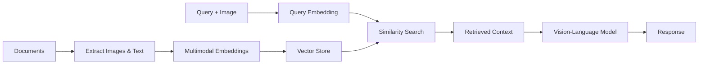

# Vision RAG

Vision RAG extends traditional RAG to handle images, diagrams, charts, and visual content using multimodal embeddings and vision-language models.

## Overview

Vision RAG capabilities:
- **Image understanding**: Extract information from images
- **Multimodal embeddings**: Embed text and images in same space
- **Visual question answering**: Query visual content naturally
- **Document analysis**: Process PDFs with charts and diagrams

<CardGroup cols={2}>
  <Card title="Multimodal Embeddings" icon="images">
    CLIP or OpenAI vision embeddings for image-text alignment
  </Card>
  <Card title="Vision Models" icon="eye">
    GPT-4V, Claude 3, or Gemini for image understanding
  </Card>
  <Card title="Document Parsing" icon="file-image">
    Extract text, images, and tables from complex PDFs
  </Card>
  <Card title="Visual Retrieval" icon="magnifying-glass">
    Search across text and visual content simultaneously
  </Card>
</CardGroup>

## Architecture



## Implementation Example

```python
from langchain_community.document_loaders import UnstructuredImageLoader
from langchain_openai import OpenAIEmbeddings
from langchain.vectorstores import Chroma

# Load images
loader = UnstructuredImageLoader("path/to/images")
images = loader.load()

# Create multimodal embeddings
embeddings = OpenAIEmbeddings(model="text-embedding-3-large")
vectorstore = Chroma.from_documents(images, embeddings)

# Query with vision model
from langchain_openai import ChatOpenAI

llm = ChatOpenAI(model="gpt-4-vision-preview")
response = llm.invoke([
    {"type": "text", "text": query},
    {"type": "image_url", "image_url": retrieved_image_url}
])
```

## Use Cases

<AccordionGroup>
  <Accordion title="Medical Imaging Analysis">
    - Analyze X-rays, MRIs, and CT scans
    - Retrieve similar cases from image database
    - Combine imaging with patient records
  </Accordion>
  
  <Accordion title="Technical Documentation">
    - Process engineering diagrams and schematics
    - Search across text and visual instructions
    - Answer questions about product designs
  </Accordion>
  
  <Accordion title="Research Papers">
    - Understand charts, graphs, and figures
    - Extract data from visualizations
    - Synthesize findings across visual and text content
  </Accordion>
</AccordionGroup>

## Best Practices

<Note>
  **Image Quality**: Ensure images are high resolution and properly preprocessed for best embedding quality.
</Note>

<Tip>
  Use separate indices for text and images, then merge results for more control over retrieval.
</Tip>

## Related Examples

<CardGroup cols={2}>
  <Card title="Basic RAG" icon="layer-group" href="/examples/basic-rag-chain">
    Start with text-only RAG
  </Card>
  <Card title="Multimodal Agents" icon="sparkles" href="/ai-agents/starter-agents">
    Build agents with vision capabilities
  </Card>
</CardGroup>