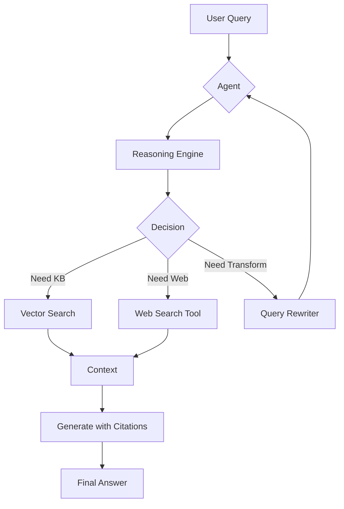

## What is Agentic RAG?

Agentic RAG extends traditional RAG with agent capabilities: reasoning, tool usage, and autonomous decision-making. Instead of a simple retrieve-and-generate pipeline, agentic RAG systems can:

- **Reason** through complex queries step-by-step
- **Use tools** to search the web when knowledge base is insufficient
- **Make decisions** about when to retrieve, transform queries, or generate answers
- **Self-correct** by validating and improving responses

## Agentic RAG Architecture



## RAG Agent with Reasoning

This implementation uses Agno framework with Gemini and reasoning capabilities:

<CodeGroup>
```python rag_reasoning_agent.py
import streamlit as st
from agno.agent import Agent
from agno.knowledge.embedder.openai import OpenAIEmbedder
from agno.knowledge.knowledge import Knowledge
from agno.models.google import Gemini
from agno.tools.reasoning import ReasoningTools
from agno.vectordb.lancedb import LanceDb, SearchType

st.set_page_config(
    page_title="Agentic RAG with Reasoning",
    page_icon="🧐",
    layout="wide"
)

st.title("🧐 Agentic RAG with Reasoning")

# API Keys
col1, col2 = st.columns(2)
with col1:
    google_key = st.text_input("Google API Key", type="password")
with col2:
    openai_key = st.text_input("OpenAI API Key", type="password")

if google_key and openai_key:
    # Initialize knowledge base
    @st.cache_resource
    def load_knowledge():
        """Load knowledge base with vector database."""
        kb = Knowledge(
            vector_db=LanceDb(
                uri="tmp/lancedb",
                table_name="agno_docs",
                search_type=SearchType.vector,
                embedder=OpenAIEmbedder(api_key=openai_key)
            )
        )
        return kb
    
    # Initialize agent with reasoning
    @st.cache_resource
    def load_agent(_kb: Knowledge):
        """Create agent with reasoning capabilities."""
        return Agent(
            model=Gemini(
                id="gemini-2.5-flash",
                api_key=google_key
            ),
            knowledge=_kb,
            search_knowledge=True,
            tools=[ReasoningTools(add_instructions=True)],
            instructions=[
                "Include sources in your response.",
                "Always search your knowledge before answering.",
            ],
            markdown=True
        )
    
    knowledge = load_knowledge()
    
    # Add URLs to knowledge base
    if 'urls_loaded' not in st.session_state:
        st.session_state.urls_loaded = set()
    
    # Load default URL
    default_url = "https://www.theunwindai.com/p/mcp-vs-a2a-complementing-or-supplementing"
    if default_url not in st.session_state.urls_loaded:
        knowledge.add_content(url=default_url)
        st.session_state.urls_loaded.add(default_url)
    
    agent = load_agent(knowledge)
    
    # Sidebar for knowledge management
    with st.sidebar:
        st.header("📚 Knowledge Sources")
        
        new_url = st.text_input("Add URL")
        if st.button("➕ Add URL"):
            if new_url:
                with st.spinner("Loading..."):
                    knowledge.add_content(url=new_url)
                    st.session_state.urls_loaded.add(new_url)
                st.success(f"Added: {new_url}")
    
    # Query section
    st.divider()
    st.subheader("🤔 Ask a Question")
    
    # Suggested prompts
    col1, col2, col3 = st.columns(3)
    with col1:
        if st.button("What is MCP?"):
            st.session_state.query = "What is MCP and how does it work?"
    with col2:
        if st.button("MCP vs A2A"):
            st.session_state.query = "How do MCP and A2A differ?"
    with col3:
        if st.button("Use Cases"):
            st.session_state.query = "What are practical use cases?"
    
    query = st.text_area(
        "Your question:",
        value=st.session_state.get("query", "")
    )
    
    if st.button("🚀 Get Answer with Reasoning"):
        if query:
            col1, col2 = st.columns([1, 1])
            
            with col1:
                st.markdown("### 🧠 Reasoning Process")
                reasoning_placeholder = st.empty()
            
            with col2:
                st.markdown("### 💡 Answer")
                answer_placeholder = st.empty()
            
            citations = []
            answer_text = ""
            reasoning_text = ""
            
            # Stream agent response
            with st.spinner("🔍 Searching and reasoning..."):
                for chunk in agent.run(
                    query,
                    stream=True,
                    stream_events=True
                ):
                    # Update reasoning
                    if hasattr(chunk, 'reasoning_content') and chunk.reasoning_content:
                        reasoning_text = chunk.reasoning_content
                        reasoning_placeholder.markdown(reasoning_text)
                    
                    # Update answer
                    if hasattr(chunk, 'content') and chunk.content:
                        answer_text += chunk.content
                        answer_placeholder.markdown(answer_text)
                    
                    # Collect citations
                    if hasattr(chunk, 'citations') and chunk.citations:
                        if hasattr(chunk.citations, 'urls'):
                            citations = chunk.citations.urls
            
            # Show citations
            if citations:
                st.divider()
                st.subheader("📚 Sources")
                for cite in citations:
                    title = cite.title or cite.url
                    st.markdown(f"- [{title}]({cite.url})")
else:
    st.info("""
    👋 **Welcome! To use this app, you need:**
    
    1. **Google API Key** - For Gemini AI model
    2. **OpenAI API Key** - For embeddings
    
    Enter your API keys above to start!
    """)
```

```python requirements.txt
streamlit
agno
openai
google-generativeai
lancedb
python-dotenv
```
</CodeGroup>

## Key Features Explained

<AccordionGroup>
  <Accordion title="Reasoning Tools">
    ```python
    from agno.tools.reasoning import ReasoningTools

    agent = Agent(
        tools=[ReasoningTools(add_instructions=True)],
        # Agent can now think step-by-step
    )
    ```
    
    **Capabilities**:
    - Break down complex queries
    - Show thinking process
    - Validate intermediate steps
    - Explain reasoning paths
  </Accordion>
  
  <Accordion title="Knowledge Search">
    ```python
    agent = Agent(
        knowledge=knowledge_base,
        search_knowledge=True,  # Enable automatic KB search
        instructions=[
            "Always search knowledge before answering",
            "Include sources in responses"
        ]
    )
    ```
    
    **Behavior**:
    - Automatically searches KB for relevant info
    - Decides when to use knowledge vs general knowledge
    - Tracks sources for citations
  </Accordion>
  
  <Accordion title="Streaming Events">
    ```python
    for chunk in agent.run(query, stream=True, stream_events=True):
        if hasattr(chunk, 'reasoning_content'):
            # Display reasoning in real-time
            display_reasoning(chunk.reasoning_content)
        
        if hasattr(chunk, 'content'):
            # Display answer as it's generated
            display_answer(chunk.content)
        
        if hasattr(chunk, 'citations'):
            # Collect sources
            sources.extend(chunk.citations.urls)
    ```
    
    **Benefits**:
    - Real-time feedback to users
    - Transparent reasoning process
    - Better user experience
  </Accordion>
</AccordionGroup>

## Autonomous RAG with PgVector

This implementation demonstrates autonomous RAG that manages its own knowledge and decisions:

```python autonomous_rag.py
import streamlit as st
from phi.agent import Agent
from phi.model.openai import OpenAIChat
from phi.knowledge.pdf import PDFKnowledgeBase, PDFReader
from phi.vectordb.pgvector import PgVector
from phi.tools.duckduckgo import DuckDuckGo

st.title("🤖 Autonomous RAG Agent")

# Initialize vector database
db_url = "postgresql+psycopg://ai:ai@localhost:5532/ai"

knowledge_base = PDFKnowledgeBase(
    path="data/pdfs",
    vector_db=PgVector(
        table_name="pdf_documents",
        db_url=db_url
    ),
    reader=PDFReader(chunk=True)
)

# Create autonomous agent
agent = Agent(
    model=OpenAIChat(id="gpt-4o"),
    knowledge=knowledge_base,
    tools=[DuckDuckGo()],  # Web search tool
    search_knowledge=True,
    instructions=[
        "Search your knowledge base first",
        "If information is not in KB, use web search",
        "Always cite your sources",
        "Be concise but comprehensive"
    ],
    show_tool_calls=True,
    markdown=True
)

# Sidebar for PDF upload
with st.sidebar:
    st.header("Upload Documents")
    uploaded_files = st.file_uploader(
        "Upload PDFs",
        type="pdf",
        accept_multiple_files=True
    )
    
    if st.button("Add to Knowledge Base"):
        if uploaded_files:
            for file in uploaded_files:
                # Save and load
                path = f"data/pdfs/{file.name}"
                with open(path, "wb") as f:
                    f.write(file.getbuffer())
            
            # Load into knowledge base
            knowledge_base.load(recreate=False)
            st.success("Documents added!")

# Chat interface
query = st.text_input("Ask a question:")

if st.button("Submit"):
    if query:
        with st.spinner("Agent thinking..."):
            # Agent autonomously decides:
            # 1. Search knowledge base
            # 2. Use web search if needed
            # 3. Combine information
            response = agent.run(query)
            
            st.markdown(response.content)
            
            # Show agent's decisions
            if response.tools_used:
                st.divider()
                st.subheader("🛠️ Tools Used")
                for tool in response.tools_used:
                    st.write(f"- {tool}")
```

## Agentic RAG with Math Reasoning

Specialized agent for math problems with RAG:

<CodeGroup>
```python query_router.py
from langchain_core.prompts import ChatPromptTemplate
from langchain_openai import ChatOpenAI
from pydantic import BaseModel, Field

class RouteQuery(BaseModel):
    """Route query to appropriate data source."""
    datasource: str = Field(
        description="Given a user question, route to 'vectorstore' or 'web_search'"
    )

class QueryRouter:
    def __init__(self, llm):
        self.llm = llm
        self.structured_llm = llm.with_structured_output(RouteQuery)
        
        self.prompt = ChatPromptTemplate.from_messages([
            ("system", """You are an expert at routing queries.
            
            Route to 'vectorstore' if the question is about:
            - Specific documents in the knowledge base
            - Domain-specific information
            - Previously uploaded content
            
            Route to 'web_search' if the question:
            - Requires current information
            - Is about general knowledge
            - Needs data not in vectorstore
            """),
            ("human", "{question}")
        ])
        
        self.chain = self.prompt | self.structured_llm
    
    def route(self, question: str) -> str:
        """Determine routing for question."""
        result = self.chain.invoke({"question": question})
        return result.datasource

# Usage
router = QueryRouter(ChatOpenAI(model="gpt-4"))
route = router.route("What are the latest AI developments?")
print(f"Route to: {route}")  # web_search
```

```python guardrails.py
from langchain_core.prompts import ChatPromptTemplate
from pydantic import BaseModel, Field

class GradeDocuments(BaseModel):
    """Binary score for relevance check."""
    binary_score: str = Field(
        description="Documents are relevant to the question, 'yes' or 'no'"
    )

class Guardrails:
    def __init__(self, llm):
        self.llm = llm.with_structured_output(GradeDocuments)
        
        self.prompt = ChatPromptTemplate.from_messages([
            ("system", """You are a grader assessing relevance of retrieved documents.
            
            Give a binary score 'yes' or 'no' to indicate whether the document
            is relevant to the user question.
            """),
            ("human", "Retrieved document:\n{document}\n\nUser question: {question}")
        ])
        
        self.chain = self.prompt | self.llm
    
    def grade_document(self, question: str, document: str) -> bool:
        """Grade if document is relevant."""
        result = self.chain.invoke({
            "question": question,
            "document": document
        })
        return result.binary_score == "yes"

# Usage
guardrails = Guardrails(ChatOpenAI(model="gpt-4"))
is_relevant = guardrails.grade_document(
    question="What is RAG?",
    document="RAG stands for Retrieval-Augmented Generation..."
)
```

```python vector.py
from langchain_chroma import Chroma
from langchain_openai import OpenAIEmbeddings
from langchain.schema import Document

class VectorStore:
    def __init__(self, collection_name: str):
        self.embeddings = OpenAIEmbeddings(
            model="text-embedding-3-large"
        )
        self.vectorstore = Chroma(
            collection_name=collection_name,
            embedding_function=self.embeddings,
            persist_directory=f"./db/{collection_name}"
        )
    
    def add_documents(self, documents: list[Document]):
        """Add documents to vector store."""
        self.vectorstore.add_documents(documents)
    
    def search(self, query: str, k: int = 5, 
               score_threshold: float = 0.7) -> list[Document]:
        """Search with score threshold."""
        return self.vectorstore.similarity_search_with_relevance_scores(
            query,
            k=k,
            score_threshold=score_threshold
        )
    
    def as_retriever(self, **kwargs):
        """Get retriever interface."""
        return self.vectorstore.as_retriever(**kwargs)
```
</CodeGroup>

## Agentic RAG Workflow with LangGraph

Building a complete agentic workflow:

```python agentic_workflow.py
from langgraph.graph import StateGraph, END
from typing import TypedDict, List
from langchain.schema import Document

class AgentState(TypedDict):
    """State of the agent."""
    question: str
    documents: List[Document]
    generation: str
    route: str
    search_needed: bool

def route_question(state: AgentState) -> AgentState:
    """Route question to vectorstore or web search."""
    router = QueryRouter(llm)
    route = router.route(state["question"])
    state["route"] = route
    return state

def retrieve_documents(state: AgentState) -> AgentState:
    """Retrieve documents from vectorstore."""
    if state["route"] == "vectorstore":
        retriever = vectorstore.as_retriever()
        docs = retriever.get_relevant_documents(state["question"])
        state["documents"] = docs
    return state

def grade_documents(state: AgentState) -> AgentState:
    """Grade document relevance."""
    guardrails = Guardrails(llm)
    filtered_docs = []
    
    for doc in state["documents"]:
        if guardrails.grade_document(state["question"], doc.page_content):
            filtered_docs.append(doc)
    
    state["documents"] = filtered_docs
    state["search_needed"] = len(filtered_docs) == 0
    return state

def web_search(state: AgentState) -> AgentState:
    """Perform web search if needed."""
    if state["search_needed"] or state["route"] == "web_search":
        search_tool = DuckDuckGo()
        results = search_tool.search(state["question"])
        
        web_docs = [
            Document(page_content=r["content"], metadata={"source": r["url"]})
            for r in results
        ]
        state["documents"].extend(web_docs)
    
    return state

def generate_answer(state: AgentState) -> AgentState:
    """Generate final answer."""
    context = "\n\n".join([doc.page_content for doc in state["documents"]])
    
    prompt = f"""
    Answer the question based on the context below.
    
    Context: {context}
    
    Question: {state["question"]}
    
    Include citations from the sources.
    """
    
    response = llm.invoke(prompt)
    state["generation"] = response.content
    return state

# Build graph
workflow = StateGraph(AgentState)

# Add nodes
workflow.add_node("route", route_question)
workflow.add_node("retrieve", retrieve_documents)
workflow.add_node("grade", grade_documents)
workflow.add_node("web_search", web_search)
workflow.add_node("generate", generate_answer)

# Define edges
workflow.set_entry_point("route")
workflow.add_edge("route", "retrieve")
workflow.add_edge("retrieve", "grade")

# Conditional edge: search if needed
workflow.add_conditional_edges(
    "grade",
    lambda x: "web_search" if x["search_needed"] else "generate",
    {
        "web_search": "web_search",
        "generate": "generate"
    }
)

workflow.add_edge("web_search", "generate")
workflow.add_edge("generate", END)

# Compile
agent_graph = workflow.compile()

# Use the agent
result = agent_graph.invoke({
    "question": "What are the latest RAG techniques?",
    "documents": [],
    "generation": "",
    "route": "",
    "search_needed": False
})

print(result["generation"])
```

## Best Practices

<CardGroup cols={2}>
  <Card title="Clear Instructions" icon="list-check">
    Give agents explicit instructions about:
    - When to search knowledge base
    - When to use tools
    - How to format responses
    - Citation requirements
  </Card>
  
  <Card title="Tool Selection" icon="screwdriver-wrench">
    Provide only necessary tools:
    - Knowledge search
    - Web search
    - Query transformation
    - Avoid tool overload
  </Card>
  
  <Card title="Reasoning Transparency" icon="eye">
    Show users the agent's:
    - Reasoning steps
    - Tool calls
    - Decision points
    - Source attribution
  </Card>
  
  <Card title="Guardrails" icon="shield-halved">
    Implement checks for:
    - Document relevance
    - Answer quality
    - Source verification
    - Hallucination detection
  </Card>
</CardGroup>

## Performance Considerations

<AccordionGroup>
  <Accordion title="Agent Latency">
    **Problem**: Agents take longer due to reasoning and tool use.
    
    **Solutions**:
    - Use streaming to show progress
    - Cache common queries
    - Parallelize independent operations
    - Use faster models for routing/grading
  </Accordion>
  
  <Accordion title="Token Usage">
    **Problem**: Reasoning increases token consumption.
    
    **Solutions**:
    - Use smaller models for simple decisions
    - Limit reasoning depth
    - Cache intermediate results
    - Optimize prompts
  </Accordion>
  
  <Accordion title="Error Recovery">
    **Problem**: Agents can fail at any step.
    
    **Solutions**:
    - Implement retry logic
    - Add fallback paths
    - Log failures for debugging
    - Provide graceful degradation
  </Accordion>
</AccordionGroup>

## Next Steps

<CardGroup cols={2}>
  <Card title="Advanced Techniques" icon="wand-magic-sparkles" href="/rag/advanced-techniques">
    Learn about corrective RAG, hybrid search, and knowledge graphs
  </Card>
  <Card title="Local RAG" icon="house" href="/rag/local-rag">
    Build privacy-focused RAG with local models
  </Card>
</CardGroup>