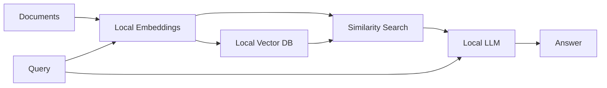

## Why Local RAG?

Local RAG implementations offer several advantages:

- **Privacy**: All data stays on your infrastructure
- **Cost**: No API fees for inference or embeddings
- **Control**: Full control over models and data
- **Compliance**: Meet regulatory requirements for data locality
- **Offline**: Work without internet connectivity

## Local RAG Architecture



All components run locally - no external API calls.

## Basic Local RAG with Ollama

Complete implementation using Ollama, Qdrant, and Agno:

<CodeGroup>
```python local_rag_agent.py
from agno.agent import Agent
from agno.models.ollama import Ollama
from agno.knowledge.knowledge import Knowledge
from agno.vectordb.qdrant import Qdrant
from agno.knowledge.embedder.ollama import OllamaEmbedder
from agno.os import AgentOS

# Vector database with local embeddings
vector_db = Qdrant(
    collection="local-knowledge",
    url="http://localhost:6333/",
    embedder=OllamaEmbedder(
        model="nomic-embed-text",  # Local embedding model
        dimensions=768
    )
)

# Knowledge base
knowledge_base = Knowledge(
    vector_db=vector_db
)

# Add documents (only need to run once)
knowledge_base.add_content(
    url="https://example.com/document.pdf"
)

# Create local RAG agent
agent = Agent(
    name="Local RAG Agent",
    model=Ollama(id="llama3.2"),  # Local LLM
    knowledge=knowledge_base,
    instructions=[
        "Answer questions based on the knowledge base",
        "Be concise and accurate",
        "Cite sources when possible"
    ]
)

# UI for agent
agent_os = AgentOS(agents=[agent])
app = agent_os.get_app()

# Run the agent
if __name__ == "__main__":
    agent_os.serve(app="local_rag_agent:app", reload=True)
```

```bash setup.sh
#!/bin/bash

# Install Ollama
curl -fsSL https://ollama.com/install.sh | sh

# Pull models
ollama pull llama3.2          # LLM for generation
ollama pull nomic-embed-text  # Embedding model

# Start Qdrant
docker run -d \
  -p 6333:6333 \
  -v $(pwd)/qdrant_storage:/qdrant/storage \
  qdrant/qdrant

# Install Python dependencies
pip install agno qdrant-client ollama
```

```python requirements.txt
agno>=2.0.0
qdrant-client
ollama
```
</CodeGroup>

## Setup Instructions

<Steps>
  <Step title="Install Ollama">
    Download and install Ollama:
    ```bash
    # macOS/Linux
    curl -fsSL https://ollama.com/install.sh | sh
    
    # Or download from https://ollama.com/download
    ```
  </Step>
  
  <Step title="Pull Local Models">
    Download models for LLM and embeddings:
    ```bash
    # LLM options (choose one or more)
    ollama pull llama3.2         # Latest Llama model (small, fast)
    ollama pull llama3.1         # Llama 3.1 (larger, more capable)
    ollama pull mistral          # Mistral 7B
    ollama pull qwen2.5          # Qwen 2.5
    ollama pull deepseek-r1:8b   # DeepSeek R1 8B
    
    # Embedding models
    ollama pull nomic-embed-text # Best for embeddings
    ollama pull openhermes       # Alternative embedder
    ```
  </Step>
  
  <Step title="Start Qdrant">
    Run Qdrant vector database:
    ```bash
    docker run -d \
      --name qdrant \
      -p 6333:6333 \
      -v $(pwd)/qdrant_storage:/qdrant/storage \
      qdrant/qdrant
    ```
  </Step>
  
  <Step title="Run Application">
    Start your local RAG agent:
    ```bash
    python local_rag_agent.py
    ```
    Open http://localhost:7777 in your browser.
  </Step>
</Steps>

## Local RAG with LangChain

Alternative implementation using LangChain:

```python llama_local_rag.py
import streamlit as st
from langchain_community.llms import Ollama
from langchain_community.embeddings import OllamaEmbeddings
from langchain_chroma import Chroma
from langchain_community.document_loaders import WebBaseLoader
from langchain_text_splitters import RecursiveCharacterTextSplitter
from langchain_core.prompts import ChatPromptTemplate
from langchain_core.output_parsers import StrOutputParser
from langchain_core.runnables import RunnablePassthrough

st.title("🦙 Local Llama RAG")

# Initialize local models
@st.cache_resource
def init_models():
    # Local embeddings
    embeddings = OllamaEmbeddings(
        model="nomic-embed-text",
        base_url="http://localhost:11434"
    )
    
    # Local LLM
    llm = Ollama(
        model="llama3.2",
        base_url="http://localhost:11434",
        temperature=0.7
    )
    
    return embeddings, llm

embeddings, llm = init_models()

# Initialize vector store
@st.cache_resource
def init_vectorstore(_embeddings):
    return Chroma(
        collection_name="local_docs",
        embedding_function=_embeddings,
        persist_directory="./local_db"
    )

vectorstore = init_vectorstore(embeddings)

# Sidebar for document loading
with st.sidebar:
    st.header("Load Documents")
    url = st.text_input(
        "Enter webpage URL:",
        placeholder="https://example.com/article"
    )
    
    if st.button("Load URL"):
        if url:
            with st.spinner("Loading and processing..."):
                # Load webpage
                loader = WebBaseLoader(url)
                documents = loader.load()
                
                # Split into chunks
                text_splitter = RecursiveCharacterTextSplitter(
                    chunk_size=500,
                    chunk_overlap=100
                )
                chunks = text_splitter.split_documents(documents)
                
                # Add to vector store
                vectorstore.add_documents(chunks)
                st.success(f"Loaded {len(chunks)} chunks from {url}")

# Query interface
query = st.text_area(
    "Ask a question:",
    placeholder="What would you like to know about the documents?"
)

if st.button("Submit"):
    if query:
        # Create retriever
        retriever = vectorstore.as_retriever(
            search_type="similarity",
            search_kwargs={'k': 5}
        )
        
        # Format documents
        def format_docs(docs):
            return "\n\n".join(doc.page_content for doc in docs)
        
        # Create prompt
        prompt = ChatPromptTemplate.from_template("""
        Answer the question based on the context below.
        
        Context: {context}
        
        Question: {question}
        
        Provide a detailed answer based on the context.
        If the answer is not in the context, say so.
        """)
        
        # Create RAG chain
        rag_chain = (
            {"context": retriever | format_docs, "question": RunnablePassthrough()}
            | prompt
            | llm
            | StrOutputParser()
        )
        
        # Execute and stream response
        with st.spinner("Thinking..."):
            response_placeholder = st.empty()
            full_response = ""
            
            for chunk in rag_chain.stream(query):
                full_response += chunk
                response_placeholder.markdown(full_response)
    else:
        st.warning("Please enter a question")
```

## Local Embedding Models

<Tabs>
  <Tab title="Nomic Embed Text">
    ```python
    from agno.knowledge.embedder.ollama import OllamaEmbedder
    
    embedder = OllamaEmbedder(
        model="nomic-embed-text",
        dimensions=768
    )
    ```
    
    **Specifications**:
    - Dimensions: 768
    - Context length: 8,192 tokens
    - Size: ~274 MB
    - Best for: General text embedding
    
    **Pull command**:
    ```bash
    ollama pull nomic-embed-text
    ```
  </Tab>
  
  <Tab title="OpenHermes">
    ```python
    from agno.knowledge.embedder.ollama import OllamaEmbedder
    
    embedder = OllamaEmbedder(
        model="openhermes",
        dimensions=4096
    )
    ```
    
    **Specifications**:
    - Dimensions: 4096
    - Context length: 4,096 tokens
    - Size: ~2.7 GB
    - Best for: High-quality embeddings
    
    **Pull command**:
    ```bash
    ollama pull openhermes
    ```
  </Tab>
  
  <Tab title="All-MiniLM-L6">
    ```python
    from sentence_transformers import SentenceTransformer
    
    model = SentenceTransformer('all-MiniLM-L6-v2')
    embeddings = model.encode(texts)
    ```
    
    **Specifications**:
    - Dimensions: 384
    - Context length: 256 tokens
    - Size: ~80 MB
    - Best for: Fast, lightweight embeddings
    
    **Install**:
    ```bash
    pip install sentence-transformers
    ```
  </Tab>
</Tabs>

## Local LLM Options

<AccordionGroup>
  <Accordion title="Llama 3.2 (Recommended)">
    ```bash
    ollama pull llama3.2
    ```
    
    **Why choose Llama 3.2**:
    - Latest Meta model
    - Good balance of speed and quality
    - 3B params: ~2GB RAM
    - Excellent for RAG tasks
    
    **Usage**:
    ```python
    from agno.models.ollama import Ollama
    
    llm = Ollama(id="llama3.2")
    ```
  </Accordion>
  
  <Accordion title="Llama 3.1">
    ```bash
    ollama pull llama3.1:8b  # 8B parameter version
    ```
    
    **Why choose Llama 3.1**:
    - More capable than 3.2
    - Better reasoning
    - 8B params: ~5GB RAM
    - Larger context window (128K)
    
    **Usage**:
    ```python
    llm = Ollama(id="llama3.1:8b")
    ```
  </Accordion>
  
  <Accordion title="Mistral 7B">
    ```bash
    ollama pull mistral
    ```
    
    **Why choose Mistral**:
    - Excellent quality
    - Good instruction following
    - 7B params: ~4GB RAM
    - Fast inference
    
    **Usage**:
    ```python
    llm = Ollama(id="mistral")
    ```
  </Accordion>
  
  <Accordion title="Qwen 2.5">
    ```bash
    ollama pull qwen2.5:7b
    ```
    
    **Why choose Qwen**:
    - Strong multilingual support
    - Excellent code generation
    - 7B params: ~4GB RAM
    - Long context (32K)
    
    **Usage**:
    ```python
    llm = Ollama(id="qwen2.5:7b")
    ```
  </Accordion>
  
  <Accordion title="DeepSeek R1">
    ```bash
    ollama pull deepseek-r1:8b
    ```
    
    **Why choose DeepSeek**:
    - Reasoning capabilities
    - Math and logic focused
    - 8B params: ~5GB RAM
    - Good for complex queries
    
    **Usage**:
    ```python
    llm = Ollama(id="deepseek-r1:8b")
    ```
  </Accordion>
</AccordionGroup>

## Local Vector Database Options

<Tabs>
  <Tab title="Qdrant">
    ```python
    from agno.vectordb.qdrant import Qdrant
    from agno.knowledge.embedder.ollama import OllamaEmbedder
    
    vector_db = Qdrant(
        collection="my_docs",
        url="http://localhost:6333/",
        embedder=OllamaEmbedder()
    )
    ```
    
    **Setup**:
    ```bash
    docker run -p 6333:6333 \
      -v $(pwd)/qdrant_storage:/qdrant/storage \
      qdrant/qdrant
    ```
    
    **Features**:
    - Fast vector search
    - Filtering support
    - Scalable
    - Web UI at http://localhost:6333/dashboard
  </Tab>
  
  <Tab title="Chroma">
    ```python
    from langchain_chroma import Chroma
    from langchain_community.embeddings import OllamaEmbeddings
    
    embeddings = OllamaEmbeddings(model="nomic-embed-text")
    
    vectorstore = Chroma(
        collection_name="documents",
        embedding_function=embeddings,
        persist_directory="./chroma_db"
    )
    ```
    
    **Features**:
    - Simple setup (no Docker needed)
    - Persistent storage
    - Good for small to medium datasets
    - Lightweight
  </Tab>
  
  <Tab title="LanceDB">
    ```python
    from agno.vectordb.lancedb import LanceDb
    from agno.knowledge.embedder.ollama import OllamaEmbedder
    
    vector_db = LanceDb(
        uri="tmp/lancedb",
        table_name="documents",
        embedder=OllamaEmbedder()
    )
    ```
    
    **Features**:
    - Serverless (embedded database)
    - Fast for analytical queries
    - No separate process needed
    - Good for prototyping
  </Tab>
  
  <Tab title="FAISS">
    ```python
    from langchain_community.vectorstores import FAISS
    from langchain_community.embeddings import OllamaEmbeddings
    
    embeddings = OllamaEmbeddings(model="nomic-embed-text")
    
    vectorstore = FAISS.from_documents(
        documents,
        embeddings
    )
    
    # Save locally
    vectorstore.save_local("faiss_index")
    
    # Load later
    vectorstore = FAISS.load_local(
        "faiss_index",
        embeddings,
        allow_dangerous_deserialization=True
    )
    ```
    
    **Features**:
    - Extremely fast
    - In-memory or disk-based
    - No server required
    - Best for high-performance needs
  </Tab>
</Tabs>

## Local Hybrid Search RAG

Combine local vector and keyword search:

```python local_hybrid_rag.py
import streamlit as st
from langchain_community.llms import Ollama
from langchain_community.embeddings import OllamaEmbeddings
from langchain_community.vectorstores import Chroma
from langchain_text_splitters import RecursiveCharacterTextSplitter
from langchain.retrievers import BM25Retriever, EnsembleRetriever
from langchain_community.document_loaders import PyPDFLoader

st.title("🔍 Local Hybrid Search RAG")

# Local models
embeddings = OllamaEmbeddings(model="nomic-embed-text")
llm = Ollama(model="llama3.2")

# Upload PDF
uploaded_file = st.file_uploader("Upload PDF", type="pdf")

if uploaded_file:
    # Save and load PDF
    with open("temp.pdf", "wb") as f:
        f.write(uploaded_file.getbuffer())
    
    loader = PyPDFLoader("temp.pdf")
    documents = loader.load()
    
    # Split documents
    text_splitter = RecursiveCharacterTextSplitter(
        chunk_size=500,
        chunk_overlap=100
    )
    chunks = text_splitter.split_documents(documents)
    
    # Create vector store (semantic search)
    vectorstore = Chroma.from_documents(
        chunks,
        embeddings,
        collection_name="hybrid_search"
    )
    vector_retriever = vectorstore.as_retriever(search_kwargs={'k': 5})
    
    # Create BM25 retriever (keyword search)
    bm25_retriever = BM25Retriever.from_documents(chunks)
    bm25_retriever.k = 5
    
    # Ensemble retriever (combines both)
    ensemble_retriever = EnsembleRetriever(
        retrievers=[vector_retriever, bm25_retriever],
        weights=[0.5, 0.5]  # Equal weight to semantic and keyword
    )
    
    st.success(f"Processed {len(chunks)} chunks")
    
    # Query
    query = st.text_input("Ask a question:")
    
    if st.button("Search") and query:
        # Retrieve using hybrid search
        docs = ensemble_retriever.get_relevant_documents(query)
        
        # Show retrieved chunks
        with st.expander("Retrieved Chunks"):
            for i, doc in enumerate(docs[:5], 1):
                st.markdown(f"**Chunk {i}**")
                st.write(doc.page_content)
                st.divider()
        
        # Generate answer
        context = "\n\n".join([doc.page_content for doc in docs])
        
        prompt = f"""Answer the question based on the context.
        
Context:
{context}

Question: {query}

Answer:"""
        
        with st.spinner("Generating answer..."):
            response = llm.invoke(prompt)
            st.subheader("Answer:")
            st.write(response)
```

## Performance Optimization

<AccordionGroup>
  <Accordion title="Model Selection">
    **Choose based on hardware**:
    
    ```python
    import psutil
    
    # Check available RAM
    ram_gb = psutil.virtual_memory().total / (1024**3)
    
    if ram_gb < 8:
        # Use smallest models
        llm_model = "llama3.2:1b"
        embed_model = "all-MiniLM-L6-v2"
    elif ram_gb < 16:
        # Use medium models
        llm_model = "llama3.2:3b"
        embed_model = "nomic-embed-text"
    else:
        # Use larger models
        llm_model = "llama3.1:8b"
        embed_model = "nomic-embed-text"
    
    print(f"Selected: {llm_model}, {embed_model}")
    ```
  </Accordion>
  
  <Accordion title="Caching">
    ```python
    import streamlit as st
    
    # Cache model initialization
    @st.cache_resource
    def load_models():
        embeddings = OllamaEmbeddings(model="nomic-embed-text")
        llm = Ollama(model="llama3.2")
        return embeddings, llm
    
    # Cache vector store
    @st.cache_resource
    def load_vectorstore(_embeddings):
        return Chroma(
            embedding_function=_embeddings,
            persist_directory="./db"
        )
    
    embeddings, llm = load_models()
    vectorstore = load_vectorstore(embeddings)
    ```
  </Accordion>
  
  <Accordion title="Batch Processing">
    ```python
    # Process documents in batches
    batch_size = 100
    
    for i in range(0, len(chunks), batch_size):
        batch = chunks[i:i + batch_size]
        vectorstore.add_documents(batch)
        print(f"Processed batch {i//batch_size + 1}")
    ```
  </Accordion>
  
  <Accordion title="GPU Acceleration">
    ```bash
    # Install Ollama with GPU support
    # NVIDIA GPU
    docker run -d --gpus=all \
      -v ollama:/root/.ollama \
      -p 11434:11434 \
      --name ollama \
      ollama/ollama
    
    # Then pull models
    docker exec -it ollama ollama pull llama3.2
    ```
    
    **Check GPU usage**:
    ```bash
    nvidia-smi
    ```
  </Accordion>
</AccordionGroup>

## Troubleshooting

<Warning>
  **Issue**: "Connection refused" to Ollama
  
  **Solution**:
  ```bash
  # Check if Ollama is running
  ps aux | grep ollama
  
  # Restart Ollama
  systemctl restart ollama
  
  # Or start manually
  ollama serve
  ```
</Warning>

<Warning>
  **Issue**: Out of memory errors
  
  **Solution**:
  - Use smaller models (3B instead of 7B)
  - Reduce chunk size and batch size
  - Close other applications
  - Consider GPU acceleration
</Warning>

<Warning>
  **Issue**: Slow response times
  
  **Solution**:
  - Use GPU if available
  - Reduce number of retrieved chunks (k=3 instead of k=5)
  - Use smaller embedding model
  - Enable model quantization
</Warning>

## Production Deployment

<Steps>
  <Step title="Containerize">
    ```dockerfile Dockerfile
    FROM python:3.11-slim
    
    # Install system dependencies
    RUN apt-get update && apt-get install -y curl
    
    # Install Ollama
    RUN curl -fsSL https://ollama.com/install.sh | sh
    
    # Copy application
    WORKDIR /app
    COPY requirements.txt .
    RUN pip install -r requirements.txt
    
    COPY . .
    
    # Pull models on build
    RUN ollama serve & \
        sleep 5 && \
        ollama pull llama3.2 && \
        ollama pull nomic-embed-text
    
    EXPOSE 8501
    CMD ["streamlit", "run", "app.py"]
    ```
  </Step>
  
  <Step title="Docker Compose">
    ```yaml docker-compose.yml
    version: '3.8'
    
    services:
      ollama:
        image: ollama/ollama
        ports:
          - "11434:11434"
        volumes:
          - ollama_data:/root/.ollama
        deploy:
          resources:
            reservations:
              devices:
                - driver: nvidia
                  count: 1
                  capabilities: [gpu]
      
      qdrant:
        image: qdrant/qdrant
        ports:
          - "6333:6333"
        volumes:
          - qdrant_data:/qdrant/storage
      
      app:
        build: .
        ports:
          - "8501:8501"
        environment:
          - OLLAMA_HOST=http://ollama:11434
          - QDRANT_URL=http://qdrant:6333
        depends_on:
          - ollama
          - qdrant
    
    volumes:
      ollama_data:
      qdrant_data:
    ```
  </Step>
  
  <Step title="Deploy">
    ```bash
    # Build and start services
    docker-compose up -d
    
    # View logs
    docker-compose logs -f app
    
    # Access at http://localhost:8501
    ```
  </Step>
</Steps>

## Cost Comparison

<CardGroup cols={2}>
  <Card title="Cloud RAG" icon="cloud">
    **Monthly costs** (1000 queries/day):
    - OpenAI embeddings: $20-50
    - OpenAI GPT-4: $200-500
    - Vector DB hosting: $50-200
    - **Total: $270-750/month**
  </Card>
  
  <Card title="Local RAG" icon="server">
    **One-time costs**:
    - Server/hardware: $500-2000
    - Setup time: 4-8 hours
    - **Monthly: $0 (electricity only)**
    - **ROI: 1-3 months**
  </Card>
</CardGroup>

## Next Steps

<Card title="Back to Overview" icon="arrow-left" href="/rag/overview">
  Return to RAG Applications overview
</Card>

<Note>
  **Hardware Recommendations**:
  - **Minimum**: 8GB RAM, CPU only - Use 1B-3B models
  - **Recommended**: 16GB RAM, CPU only - Use 3B-7B models
  - **Optimal**: 16GB+ RAM, NVIDIA GPU (8GB+ VRAM) - Use 7B-13B models
</Note>
